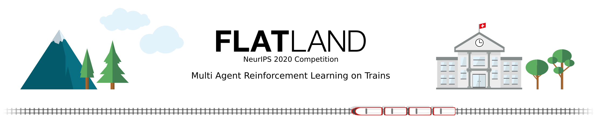

ECML 2026
=========

The **[ECML 2026 Challenge](https://competition.flatland.cloud/suites/6240c685-0fb4-481e-9404-47a570632227)** is the newest competition around the **Flat**land environment.

<!--  -->

- Follow the [starterkit](https://github.com/flatland-association/ecml2026-starterkit) to make your first submission.
- Read about the [evaluations metrics](ecml2026/eval) of this edition.
- Read about the [level configurations](ecml2026/levelconfig) of this edition.

⏱ Timeline
--------

* Competition start: May 4th, 2026
* Submission closure: June 8th, 2026 (AoE)
* Winner announcement: June 15th, 2026

⭐ Supported Flatland Versions
-----------------------------
You must use Flatland version [4.2.5](https://github.com/flatland-association/flatland-rl/releases/tag/v4.2.5).