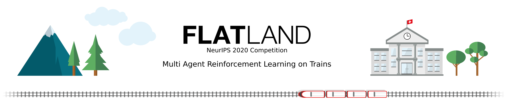
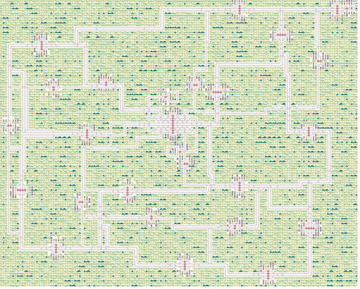
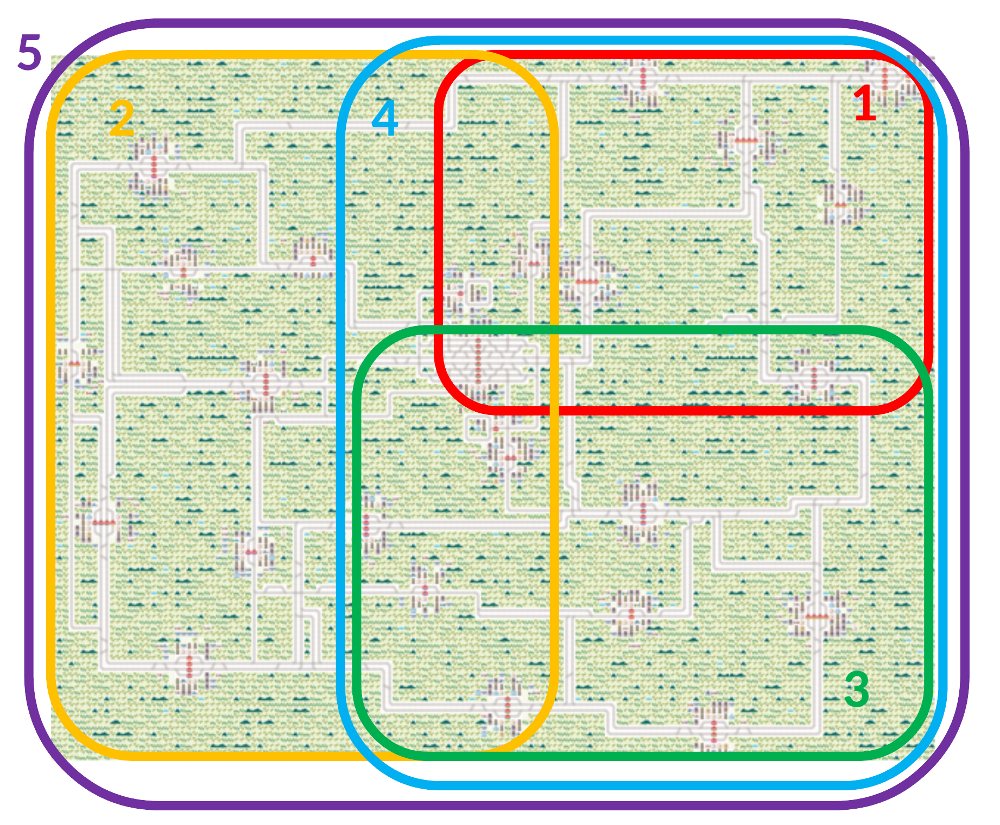

ECML 2026
=========

The **[ECML 2026 Challenge](https://competition.flatland.cloud/suites/6240c685-0fb4-481e-9404-47a570632227)** is the newest competition around the Flatland
environment.

<!--  -->

- Follow the [starterkit](https://github.com/flatland-association/ecml2026-starterkit) to make your first submission.
- Read about the [evaluations metrics](ecml2026/eval) of this edition.
- Read about the [level configurations](ecml2026/levelconfig) of this edition.

⏱ Timeline
--------

* Competition start: May 4th, 2026
* Competition end: June 29th, 2026 (AoE) (new!)
* Winner announcement: July 6th, 2026 (**new!**)

🗺️ Topology
----------
The competition runs on a single topology (120 x 150) with 28 stations:

The map is subdivided into five *scenes* (i.e. regions):

The scenes correspond to the scenarios in each level with the exception of level 6, where all five scenarios use scene 5 (
cf. [level configurations](ecml2026/levelconfig)).

Competition features:

- Intermediate stops: the lines have **intermediate** stops. The environment does not enforce agents to pass by intermediate stops, but agents (trains) are
  penalized
  if they skip intermediate stops are do not respect time windows defined for intermediate stops, see [ECML 2026 Evaluation Metrics](ecml2026/eval.md).
  Intermediate stops are defined by a set of alternative grid cells in the same station.
- Speeds: the agents always run at their train category's `max_speed<=1.0` or at zero, we do not use variable speed in the competition (i.e.
  `acceleration_delta=1.0` and `braking_delta=-1.0` see [Actions](../environment/actions))

⭐ Supported Flatland Versions
-----------------------------
You must use Flatland version [4.2.5](https://github.com/flatland-association/flatland-rl/releases/tag/v4.2.5)
or [4.2.6](https://github.com/flatland-association/flatland-rl/releases/tag/v4.2.6).