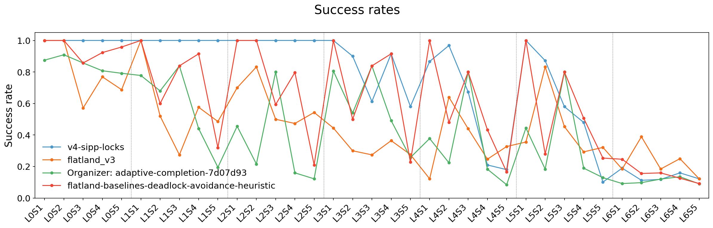
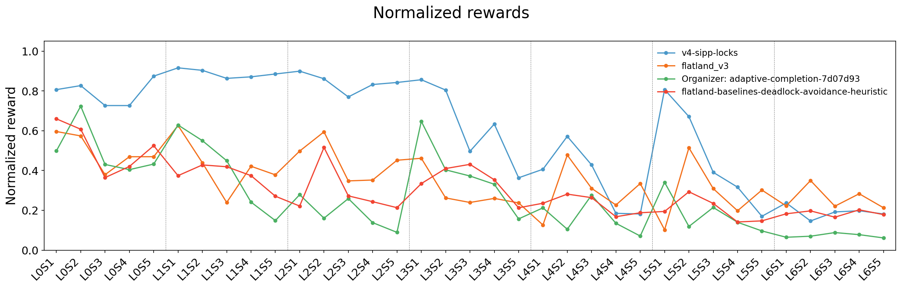
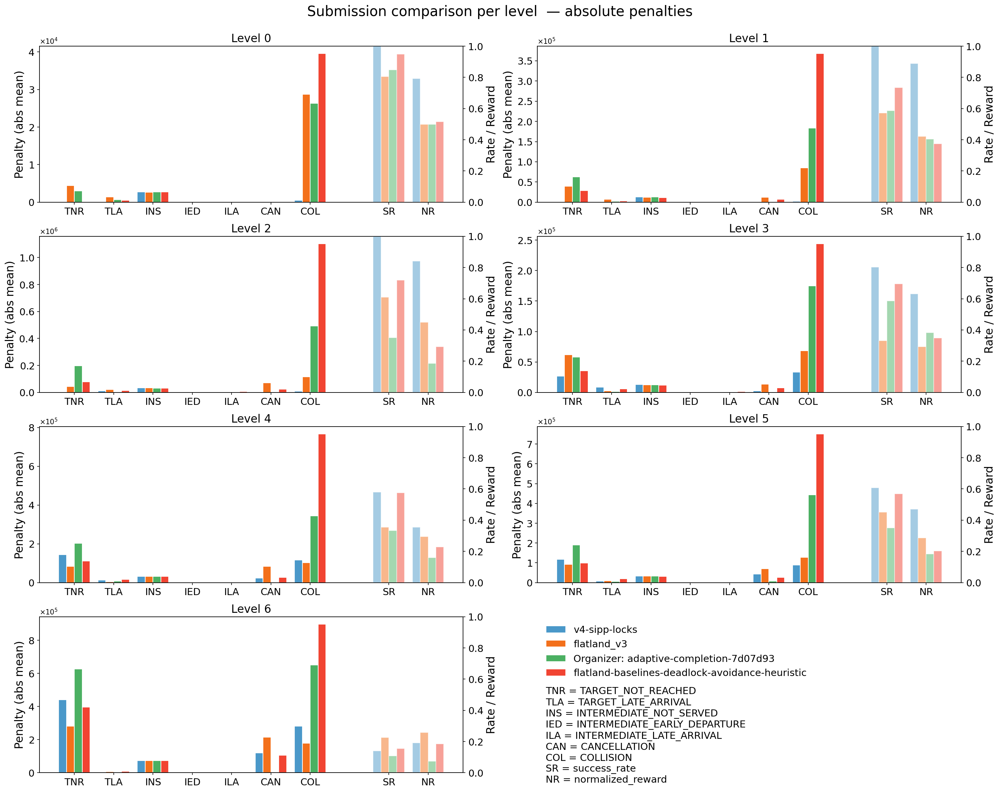
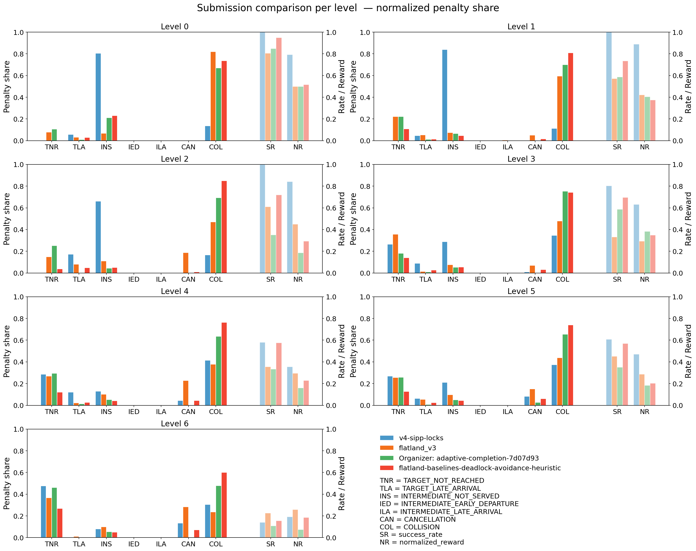
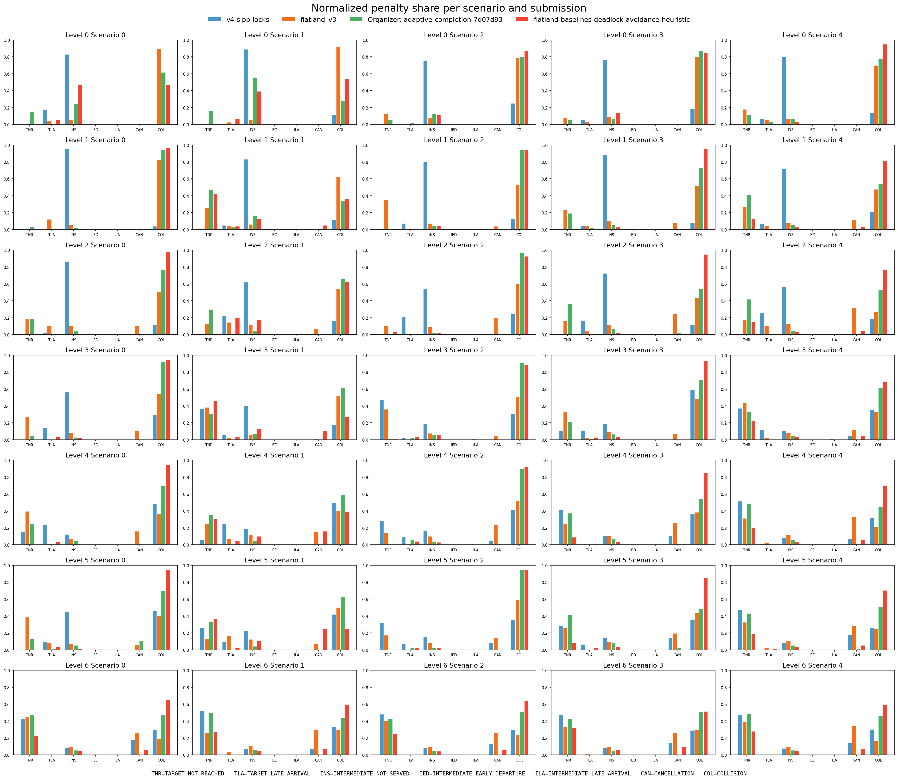
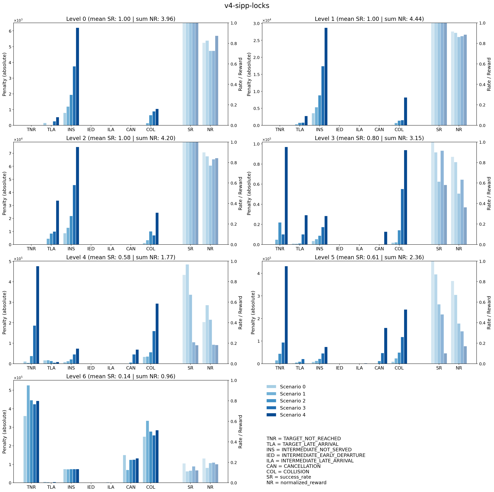
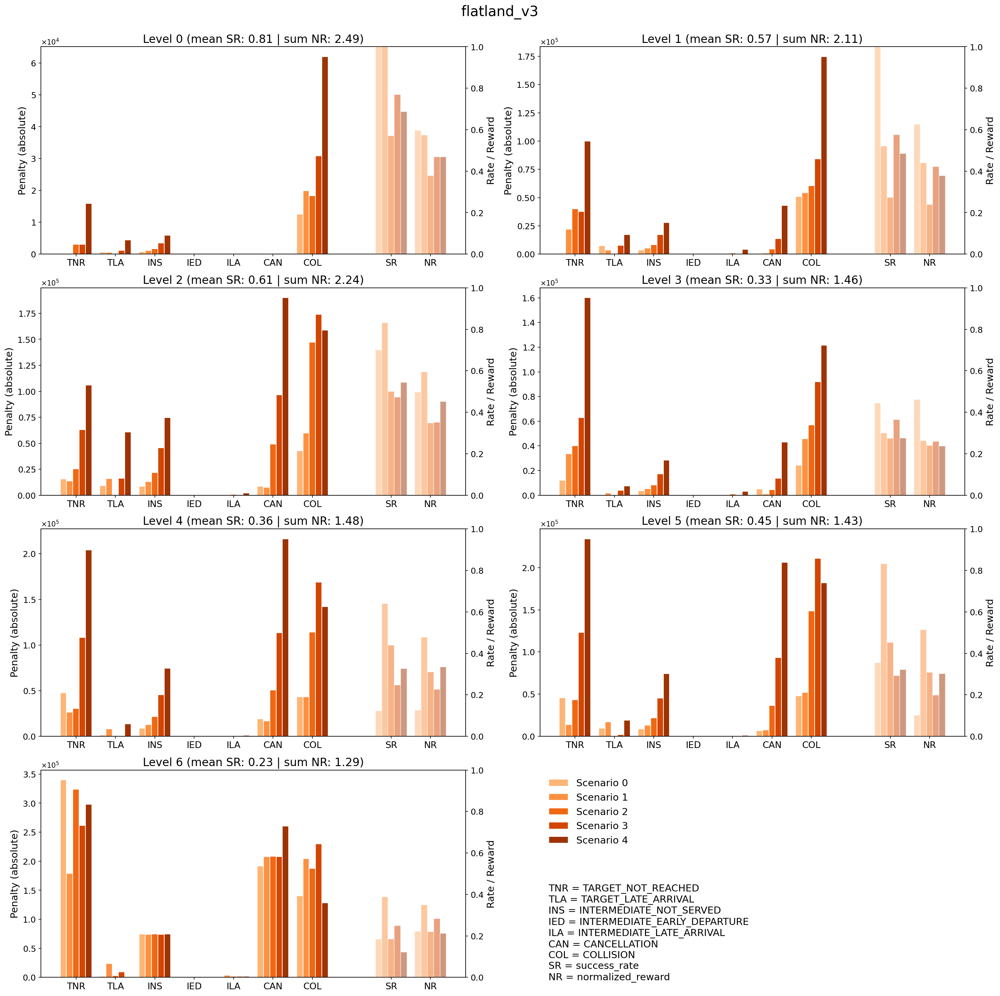
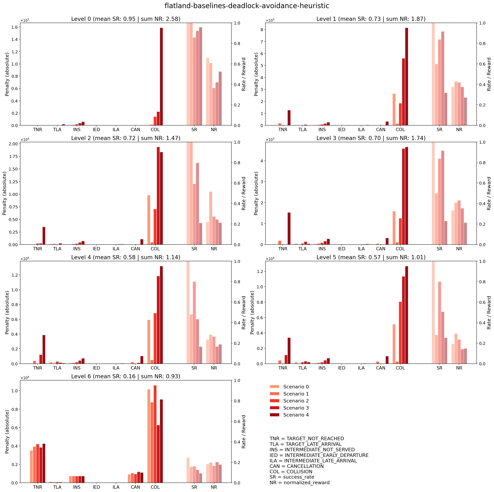
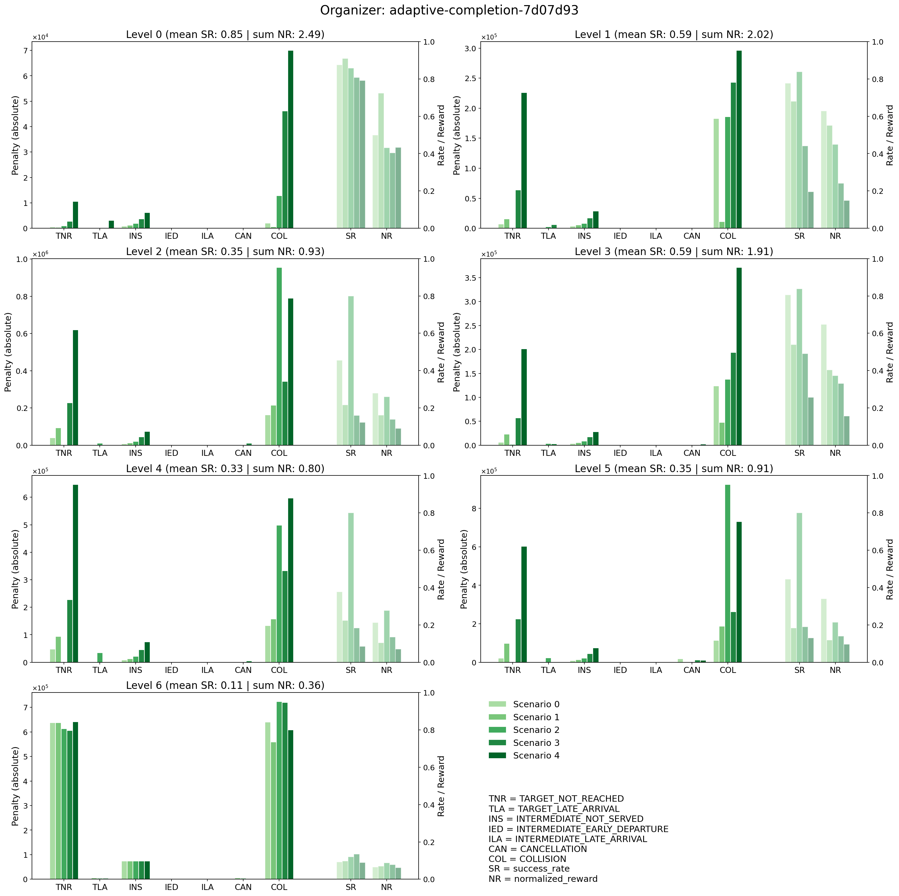
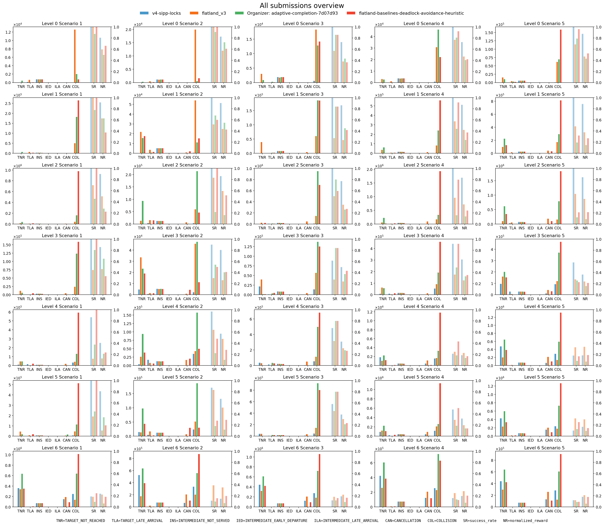

# Post-competition Analysis

This section provides an overview of the two winning solutions and the baselines for both the RL and non-RL tracks.

## Competition Paper

[Real-World Baselines Challenge: Dynamic Train Rescheduling under Stochastic Perturbations](./Real_World_Baselines_Challenge__Dynamic_Train_Rescheduling_under_Stochastic_Perturbations.pdf) (under review; will be published in the ECML PKDD conference journal)

## Leaderboard

| Track  | Name                                                                                                                                                                                                                              | Score   | Submitted by      | Repo                                                                                             |
| ------ | --------------------------------------------------------------------------------------------------------------------------------------------------------------------------------------------------------------------------------- | ------- | ----------------- | ------------------------------------------------------------------------------------------------ |
| non-RL | [v4-sipp-locks](https://competition.flatland.cloud/suites/6240c685-0fb4-481e-9404-47a570632227/c85d5fc2-15da-4a62-8e14-28d1261c29bd/submissions/9f2952a6-fb6b-4140-be5e-ca118baaa74e)                                             | 20.8429 | darshanmakwana412 | [ecml2026](https://github.com/darshanmakwana412/ecml2026)                                        |
| non-RL | [flatland_v3](https://competition.flatland.cloud/suites/6240c685-0fb4-481e-9404-47a570632227/c85d5fc2-15da-4a62-8e14-28d1261c29bd/submissions/fbf31831-4260-4711-bb74-e4ecfcacaa4c)                                               | 12.4925 | ge48cel           | [v5-dispatcher](https://github.com/Avinash837/ecml2026-starterkit/tree/v5-dispatcher-submission) |
| non-RL | Baseline: [flatland-baselines-deadlock-avoidance-heuristic](https://competition.flatland.cloud/suites/6240c685-0fb4-481e-9404-47a570632227/c85d5fc2-15da-4a62-8e14-28d1261c29bd/submissions/dfdee0df-4640-41b5-bb26-a34a75cfc2a4) | 10.7320 | chenkins          | https://github.com/flatland-association/flatland-baselines                                       |
| RL     | Baseline: [Organizer: adaptive-completion-7d07d93](https://competition.flatland.cloud/suites/6240c685-0fb4-481e-9404-47a570632227/c85d5fc2-15da-4a62-8e14-28d1261c29bd/submissions/e7fd3100-df18-4772-9049-bdff62791d66)          | 9.4231  | roman.liessner    | https://github.com/dynamik1703/ecml2026-starterkit                                               |

## Evaluation

See [eval.md](./eval.md) for rewards and normalized rewards definitions.

### Sucess Rates

### Normalized Rewards

### Submission Comparison per Level

### Submission Comparison per Scenario

See [eval.md](./eval.md) for the definition of the reward categories normalized score.

### Detailed Plots per Submission

## Detailed Overview Plot

