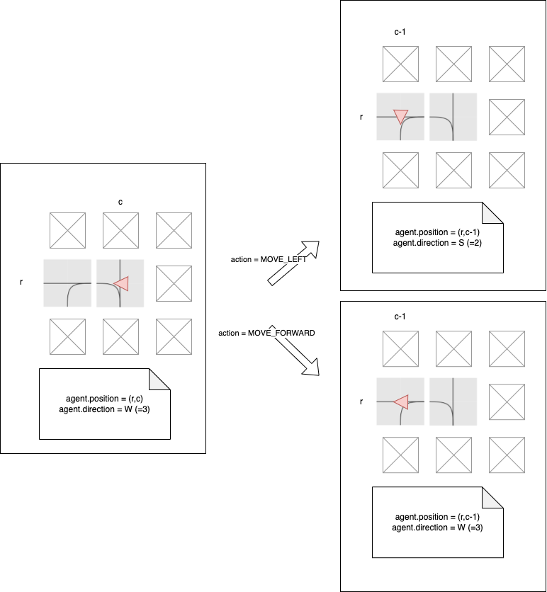

Actions
=======

The trains in Flatland have strongly limited movements, as you would expect from a railway simulation. This means that only a few actions are valid in most
cases.

Here are the possible actions:

- **`DO_NOTHING`**:  If the agent is already moving, it continues moving. If it is stopped, it stays stopped. Special case: if the agent is at a dead-end, this
  action will result in the train turning around.
- **`MOVE_LEFT`**: This action is only valid at cells where the agent can change direction towards the left. If chosen, the left transition and a rotation of
  the agent orientation to the left is executed. If the agent is stopped, this action will cause it to start moving in any cell where forward or left is
  allowed!
- **`MOVE_FORWARD`**: The agent will move forward. This action will start the agent when stopped. At switches, this will choose the forward direction.
- **`MOVE_RIGHT`**: The same as deviate left but for right turns.
- **`STOP_MOVING`**: This action causes the agent to stop.

Flatland is a discrete time simulation, i.e. it performs all actions with constant time step. A single simulation step synchronously moves the time forward by a
constant increment, thus enacting exactly one action per agent per timestep.

```{admonition} Code reference
The actions are defined in [flatland.envs.rail_env.RailEnvActions](https://github.com/flatland-association/flatland-rl/blob/main/flatland/envs/rail_env.py#L69).

You can refer to the directions in your code using e.g., `RailEnvActions.MOVE_FORWARD`, `RailEnvActions.MOVE_RIGHT`...
```

The following diagram shows the interplay of agent position/direction and actions.

The agent (red triangle) is in left switch cell with direction `W`. The left neighbor cell is a left switch, too.
Upon entering the new cell, the `MOVE_LEFT` action will update the agent's direction to `S`, and the `MOVE_FORWARD` direction will keep the agent's direction at
`W`.



> *Pro memoria*
>
> **current position and direction** determine **next cell**
>
> **action** determines **next direction**


