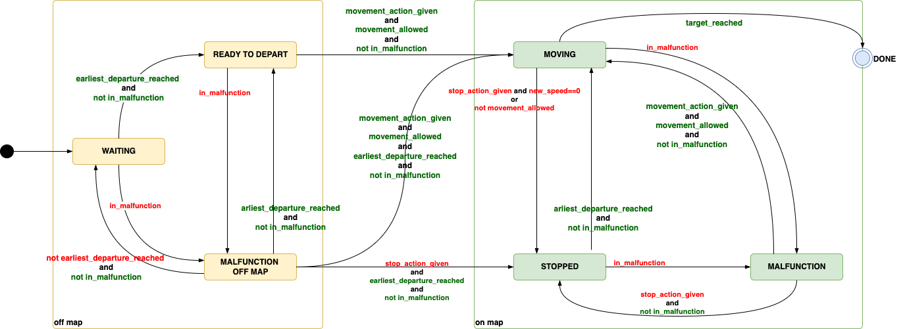

Agents and State Machine
========================


The agents are represented as an agent class and are provided when the environment is instantiated. Because agents can have different properties it is helpful
to know how to access this information.

You can simply access the three main types of agent information in the following ways `agent = env.agents[handle]`

Agent basic information
-----------------------

All the agent in the initiated environment can be found in the env.agents class. Given the index of the agent you have access to:

- **Agent position:** `agent.position` which returns the current coordinates (x, y) of the agent.
- **Agent target:** `agent.target` which returns the target coordinates (x, y).
- **Agent direction:** `agent.direction` which is an int representing the current orientation {0: North, 1: East, 2: South, 3: West}
- **Agent moving:** `agent.state` is the state of the agent's state machine, when moving, `agent.state == TrainState.MOVING` indicates that the train in
  currently on the map and moving.

Agent timetable information
-----------------------

In **Flat**land 3, agents have a time window within which they must start and reach their destination. The following properties specify the time window:

- **Earliest departure:** `agent.earliest_departure` specifies the earliest time step of the simulation at which the agent is allowed to depart.
- **Latest arrival:** `agent.latest_arrival` specifies the latest time step of the simulation before or at which the agent is expected to reach it's
  destination.

Agent malfunction information
-----------------------

Similar to the speed data you can also access individual data about the
malfunctions of an agent. All data is available through
`agent.malfunction_handler` with:

- **`malfunction_down_counter`:** Indication how long the agent is still malfunctioning by an integer counting down at each time step. `0` means the agent is ok
  and can move.
- **`num_malfunctions`:** Number of malfunctions an agent have occurred for this agent so far

Agent speed information
-----------------------

Beyond the basic agent information we can also access more details about
the agents type by looking at `agent.speed_counter`:

- **Agent speed:** `agent.speed_counter.speed` wich defines the traveling speed when the agent is moving.
- **Agent speed counter:** When the speed of an agent is fractional, the agent stays in the same cell for more than one step, specifically for
  `agent.speed_counter.max_count + 1` number of steps. The value `agent.speed_counter.counter` indicates when the move to the next cell will occur, this number
  is 0 indexed. When this value reaches the value of `agent.speed_counter.max_counter`, the agent can exit the cell to the next one. At each `env.step` the
  agent increments its speed counter if the agent state is moving.
- `agent.speed_counter.is_cell_entry` indicates whether the agent just entered the cell and `agent.speed_counter.is_cell_exit` indicates the agent can exit the
  cell next step.

State Machine
--------------


Flatland 3 introduces a state machine for every agent that controls the behavior of the agent depending on the current state.
The functionality is essentially the same as Flatland 2, this change is
primarily to help users who want to read and modify the code easily, it is a refactoring of `env.step` function in Flatland.

The goal is to provide a unified state machine which controls the state and transitions of the trains, rather than the older system which had a mix of
`agent.moving` and `agent.status`.

The possible states are `WAITING`, `READY_TO_DEPART`, `MALFUNCTION_OFF_MAP`, `MOVING`, `STOPPED`, `MALFUNCTION`, and `DONE`.

The figure below illustrates the working of the state machine.



[//]: # (```mermaid)

[//]: # (%%{ init: { 'theme': 'base', 'themeVariables': { 'background': '#f4f4f4' } } }%%)

[//]: # (graph TB)

[//]: # (    START&#40;&#40;"&nbsp;"&#41;&#41; --> WAITING)

[//]: # (    MALFUNCTION_OFF_MAP -- NOT <font color = green>in_malfunction</font><br/><font color = red>earliest_departure_reached</font><br/><font color = red>stop_action_given</font> --> STOPPED)

[//]: # (    READY_TO_DEPART -- <font color = red>in_malfunction</font> --> MALFUNCTION_OFF_MAP)

[//]: # (    READY_TO_DEPART -- <font color = green>valid_movement_action_given</font> --> MOVING)

[//]: # (    MALFUNCTION_OFF_MAP -- NOT <font color = green>in_malfunction</font><br/><font color = red>earliest_departure_reached</font><br/><font color = green>valid_movement_action_given</font> --> MOVING)

[//]: # (    MOVING -- NOT <font color = red>in_malfunction</font><br/><font color = green>target_reached</font> --> DONE)

[//]: # (    DONE --> END&#40;&#40;&#40;"&nbsp;"&#41;&#41;&#41;)

[//]: # (    subgraph On Map States)

[//]: # (        direction TB)

[//]: # (        WAITING -- <font color = red>in_malfunction</font> --> MALFUNCTION_OFF_MAP)

[//]: # (        WAITING -- <font color = red>earliest_departure_reached</font> --> READY_TO_DEPART)

[//]: # (        MALFUNCTION_OFF_MAP -- NOT <font color = green>in_malfunction</font><br/><font color = red>earliest_departure_reached</font><br/>NOT <font color = red>stop_action_given</font><br/>NOT <font color = green>valid_movement_action_given</font> --> READY_TO_DEPART)

[//]: # (        MALFUNCTION_OFF_MAP -- NOT <font color = green>in_malfunction</font><br/>NOT <font color = red>earliest_departure_reached</font> --> WAITING)

[//]: # (    end)

[//]: # ()

[//]: # (    subgraph Off Map States)

[//]: # (        direction TB)

[//]: # (        MOVING -- <font color = red>in_malfunction</font> --> MALFUNCTION)

[//]: # (        MOVING -- NOT <font color = red>in_malfunction</font><br/>NOT <font color = green>target_reached</font><br/><font color = red>stop_action_given</font> AND new_speed = = 0 --> STOPPED)

[//]: # (        STOPPED -- <font color = red>in_malfunction</font> --> MALFUNCTION)

[//]: # (        STOPPED -- NOT <font color = red>in_malfunction</font><br/><font color = green>valid_movement_action_given</font> --> MOVING)

[//]: # (        MALFUNCTION -- NOT <font color = green>in_malfunction</font><br/><font color = green>valid_movement_action_given</font> --> MOVING)

[//]: # (        MALFUNCTION -- NOT <font color = green>in_malfunction</font><br/>NOT <font color = green>valid_movement_action_given</font> --> STOPPED)

[//]: # (    end)

[//]: # ()

[//]: # (    START:::StartState)

[//]: # (    WAITING:::OffMapState)

[//]: # (    READY_TO_DEPART:::OffMapState)

[//]: # (    MALFUNCTION_OFF_MAP:::OffMapState)

[//]: # (    MOVING:::OnMapState)

[//]: # (    STOPPED:::OnMapState)

[//]: # (    MALFUNCTION:::OnMapState)

[//]: # (    END:::EndState)

[//]: # (    classDef OffMapState font-style: italic, font-weight: bold, fill: yellow, color: black)

[//]: # (    classDef OnMapState font-style: italic, font-weight: bold, fill: green, color: black)

[//]: # (    classDef StartState font-style: italic, font-weight: bold, fill: black, color: black)

[//]: # (    classDef EndState font-style: italic, font-weight: bold, fill: black, color: black)

[//]: # (```)

[//]: # ()

[//]: # (`valid_movement_action_given` stands for `movement_action_given` and `movement_allowed`)

[//]: # ()

[//]: # (Legend:)

[//]: # ()

[//]: # (```mermaid)

[//]: # (%%{ init: { 'theme': 'base', 'themeVariables': { 'background': '#f4f4f4' } } }%%)

[//]: # (stateDiagram-v2)

[//]: # (    direction LR)

[//]: # (    state "On Map State" as OnMapState)

[//]: # (    state "Off Map State" as OffMapState)

[//]: # (    OffMapState:::OffMapState)

[//]: # (    OnMapState:::OnMapState)

[//]: # (    state "State 1" as State1)

[//]: # (    state "State 2" as State2)

[//]: # (    state "State 1" as State3)

[//]: # (    state "State 2" as State4)

[//]: # (    State1 --> State2: <font color=red>Stopping signal</font>)

[//]: # (    State3 --> State4: <font color=green>Moving signal</font>)

[//]: # (    classDef OffMapState font-style: italic, font-weight: bold, fill: yellow, color: black)

[//]: # (    classDef OnMapState font-style: italic, font-weight: bold, fill: green, color: black)

[//]: # (```)


The principles we try to implement are as follows:

1. Only a single state transtition is allowed per `env.step`.

2. The action preprocessing ,position changes, speed counters and malfunctions are controlled by the state.

3. All signals for transitioning between states are generated in one place, for easy readability.

## State descriptions

The purpose of each state is described below:

|        State        |            Map Position             | Description                                                                                                                                                                                                                   |
|:-------------------:|:-----------------------------------:|:------------------------------------------------------------------------------------------------------------------------------------------------------------------------------------------------------------------------------|
|       WAITING       |               Off Map               | No actions allowed here, when current timestep is behind earliest departure.                                                                                                                                                  |
|   READY_TO_DEPART   |               Off Map               | Train is ready to move and will start at `initial_position` when moving action is provided.                                                                                                                                   |
| MALFUNCTION_OFF_MAP |               Off Map               | When a randomized malfunction occurs in an `off map` state, any moving actions provided here are stored and used when malfunction completes, unless stop action is provided.                                                  |
|       MOVING        |               On Map                | Indicates the train is moving, if speed is 1.0, the train changes position every timestep.                                                                                                                                    |
|       STOPPED       |               On Map                | Indicates the train is stopped, this can occur when the user provides a stop action, or the train tries to move into a cell that is occupied or to a cell which does not have a track.                                        |
|     MALFUNCTION     |               On Map                | When a randomized malfunction occurs in an `on map` state, any moving actions provided here are stored and used when malfunction completes, unless stop action is provided. No movement can occur during a malfunction state. |
|        DONE         | Depends on `remove_agent_at_target` | This is the terminal state which is activated when the target is reached.                                                                                                                                                     |

## State transition signals

The corresponding signals in the state machine are described below

| State Transition Signal      | Description                                                                                                                                                                            |
|------------------------------|----------------------------------------------------------------------------------------------------------------------------------------------------------------------------------------|
| `in_malfunction`             | Malfunction states start when in_malfunction is set to true                                                                                                                            |
| `earliest_departure_reached` | Earliest departure reached - Train is allowed to move now                                                                                                                              |
| `stop_action_given`          | Stop Action Given - User provided a stop action. Action preprocessing can also change a moving action to a stop action if the train tries to move into a invalid or occupied position. |
| `movement_action_given`      | Movement action is provided.                                                                                                                                                           |
| `target_reached`             | Target position is reached                                                                                                                                                             |
| `movement_allowed`           | Movement allowed if inside cell or at end of cell and no conflict with other trains ("motion check")                                                                                   |
| `new_speed`                  | The new speed: `MOVE_FORWARD` means accelerate and `STOP_MOVING` means braking. `MOVE_LEFT` and `MOVE_RIGHT` do not accelerate.                                                        |

[//]: # (## Old state diagram)

[//]: # ()

[//]: # (![Flatland 3 State Machine]&#40;https://flatland-association.github.io/flatland-book/_images/Flatland_3_State_Machine.jpg&#41;)

[//]: # ()

[//]: # (### Differences with code of old diagram added in the new diagram above)

[//]: # ()

[//]: # (* `MALFUNCTION OFF MAP --> READY_TO_DEPART`: malfunction_counter_complete and earliest_departure_reached **and not valid_movement_action_given and not)

[//]: # (  stop_action_given**)

[//]: # (* `MOVING --> DONE`: **not in_malfunction** and target_reached)

[//]: # (* `MOVING --> STOPPED`: **not in_malfunction and not target_reached** and &#40;stop_action_given or movement_conflict&#41;)

[//]: # (* `MALFUNCTION --> STOPPED`: malfunction_counter_complete **and not in_malfunction and not valid_movement_action_given**)