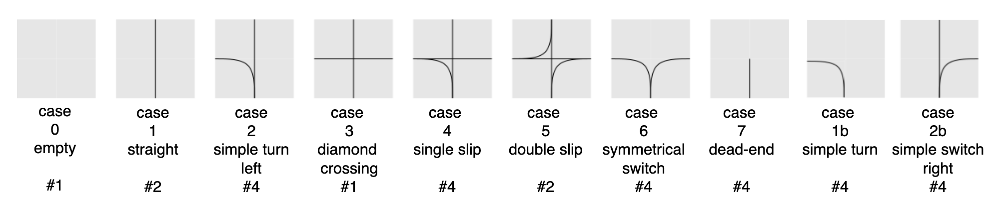

Environment and Transitions
==============================

Flatland is a 2D rectangular grid environment of arbitrary width and height, where the most primitive unit is a cell. Each cell has the capacity to hold a
single agent (train).

An agent in a cell can have a discrete orientation direction which represents the cardinal direction the agent is pointing to. An agent can move to a subset of
adjacent cells. The subset of adjacent cells that an agent is allowed to transition to is defined by a 4-bit transition map representing possible transitions in
4 different directions.



*10 basic cells modulo rotation enable us to implement any real-world railway network in the flatland env*
This gives a set of 30 valid transitions in total (see `#` giving number of rotations).

Agents can only travel in the direction they are currently facing. Hence, the permitted transitions for any given agent depend both on its position and on its
direction. Transition maps define the railway network in the flatland world. One can implement any real world railway network within the Flatland environment by
manipulating the transition maps of cells.


Transitions maps
----------------

The transition maps build the base for all movements in the environment. They contain all the information about allowed transitions for the agent at any given
position. Because railway movement is limited to the railway tracks, these are important features for any controller that wants to interact with the
environment.

```{admonition} Code reference
All functionality and features of transition maps can be found in [core/transition_map.py](https://github.com/flatland-association/flatland-rl/blob/main/flatland/core/transition_map.py).
```

There are two different possibilities to access the possible transitions at any given cell:

### get_transitions()

Provide a cell position and an orientation (usually the orientation of the agent) and call `env.rail.get_transitions(*position, direction)`. In return, you get
will a 4D vector with the transition probability ordered as [North, East, South, West] given the initial orientation.

The position is a tuple of the form `(x, y)` where $x \in [0, h]$ and $y \in [0, w]$ with $h$ and $w$ the height and width of the environment. This can be used
for branching in a tree search and when looking for all possible allowed paths of an agent as it will provide a simple way to get the possible trajectories.

### get_full_transitions()

When more detailed information about the cell is necessary, you can also get the **full** transitions of a cell by calling
`env.rail.get_full_transitions(*position)`. This will return an `int16` for the cell representing the allowed transitions.

To understand the transitions returned it is best to represent it as a binary number `bin(transition_int)`, where the bits have to following meaning: NN NE NS
NW EN EE ES EW SN SE SS SW WN WE WS WW.

For example, the binary code 1000 0000 0010 0000, represents a straight where an agent facing north can transition north and an agent facing south can
transition south and no other transitions are possible.

To get a better feeling of what the binary representations of the elements look like, check the special cases of `GridTransitions` in [
`RailEnvTransitions`](https://github.com/flatland-association/flatland-rl/blob/main/flatland/core/grid/rail_env_grid.py#L28). They are the set of transitions
mimicking the types of real Swiss rail connections:

```python
transition_list = [int('0000000000000000', 2),  # empty cell - Case 0
                   int('1000000000100000', 2),  # Case 1 - straight
                   int('1001001000100000', 2),  # Case 2 - simple switch
                   int('1000010000100001', 2),  # Case 3 - diamond drossing
                   int('1001011000100001', 2),  # Case 4 - single slip
                   int('1100110000110011', 2),  # Case 5 - double slip
                   int('0101001000000010', 2),  # Case 6 - symmetrical
                   int('0010000000000000', 2),  # Case 7 - dead end
                   int('0100000000000010', 2),  # Case 1b (8)  - simple turn right
                   int('0001001000000000', 2),  # Case 1c (9)  - simple turn left
                   int('1100000000100010', 2)]  # Case 2b (10) - simple switch mirrored
```

These two objects can be used for example to detect switches that are usable by other agents, but not the observing agent itself. This can be an important
feature when actions have to be taken in order to avoid conflicts.

```python
cell_transitions = self.env.rail.get_transitions(*position, direction)
transition_bit = bin(self.env.rail.get_full_transitions(*position))

total_transitions = transition_bit.count("1")
num_transitions = np.count_nonzero(cell_transitions)

# Detect Switches that can only be used by other agents.
if total_transitions > 2 > num_transitions:
    unusable_switch_detected = True
```
