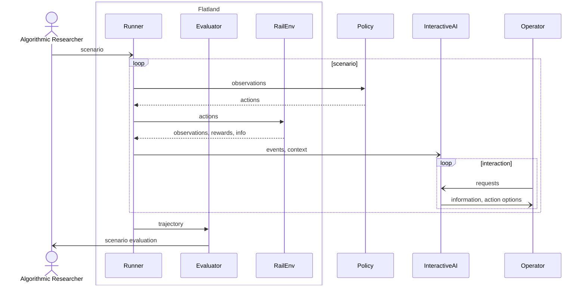
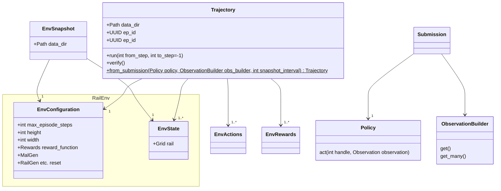
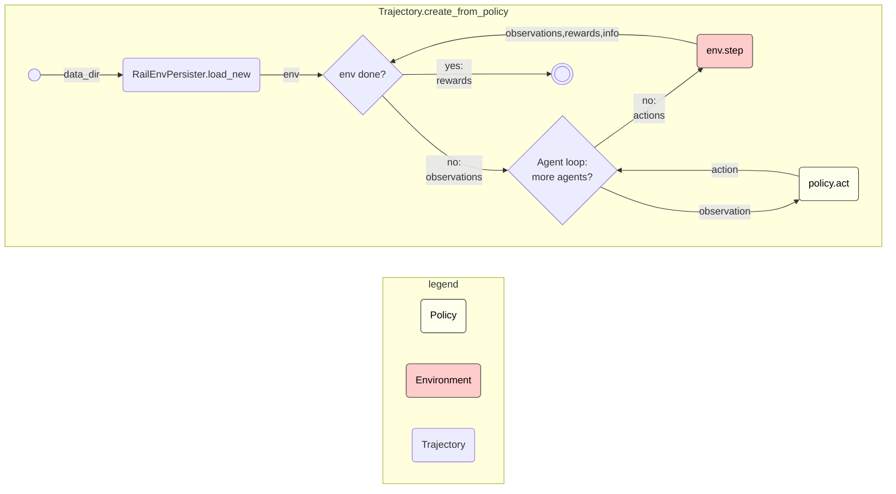
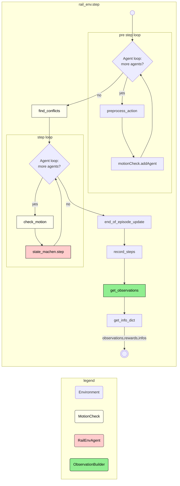
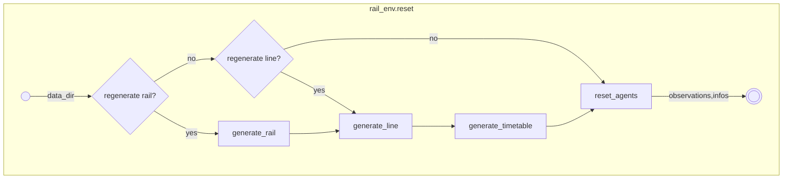

Key Concepts
============
To help you get a high-level understanding of how the Flatland works, on this page, you learn about the key concepts and general architecture.

Building Block View
-------------------

Data Model
----------

Remarks:

* Trajectory needs not start at step 0
* Trajectory needs not contain state for every step - however, when starting the trajectory from an intermediate step, the snapshot must exist.

Flow Runner
-----------

Flow RailEnv Step
-----------------

Flow Env Reset
--------------

