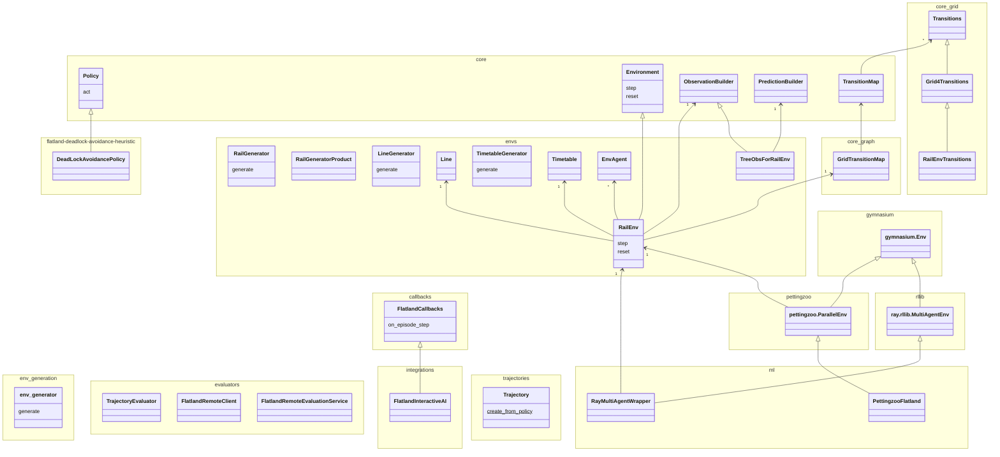

Key Concepts
============

Building Block View
-------------------

```mermaid
classDiagram
    direction BT
    namespace core {
        class Policy {
            act
        }
        class Environment {
            step
            reset
        }

        class ObservationBuilder
        class PredictionBuilder
        class TransitionMap
        class GridTransitionMap
    }
    namespace callbacks {
        class FlatlandCallbacks {
            on_episode_step
        }
    }
    namespace  core_grid {
        class Transitions
        class Grid4Transitions
        class RailEnvTransitions
    }
    namespace  core_graph {
        class GridTransitionMap
    }
    namespace env_generation {
        class env_generator {
            generate
        }
    }
    namespace envs {
        class RailEnv {
            step
            reset
        }

        class RailGenerator {
            generate
        }
        class RailGeneratorProduct
        class LineGenerator {
            generate
        }
        class Line
        class TimetableGenerator {
            generate
        }
        class Timetable
        class EnvAgent
        class TreeObsForRailEnv
    }

    namespace evaluators {
        class TrajectoryEvaluator

        class FlatlandRemoteClient
        class FlatlandRemoteEvaluationService
    }

    namespace integrations {
        class FlatlandInteractiveAI
    }

    namespace ml {
        class PettingzooFlatland
        class RayMultiAgentWrapper
    }

    namespace trajectories {
        class Trajectory {
            create_from_policy$
        }
    }

    namespace flatland-deadlock-avoidance-heuristic {
        class DeadLockAvoidancePolicy
    }

    namespace pettingzoo {
        class PettingZooParallelEnv["pettingzoo.ParallelEnv"]
    }

    namespace rllib {
        class RllibMultiAgentEnv["ray.rllib.MultiAgentEnv"]
    }
    namespace gymnasium {
        class gymEnv["gymnasium.Env"] {
        }
    }
    RailEnv --|> Environment
    FlatlandInteractiveAI --|> FlatlandCallbacks
    DeadLockAvoidancePolicy --|> Policy
    Grid4Transitions --|> Transitions
    RailEnvTransitions --|> Grid4Transitions
    GridTransitionMap --> TransitionMap
    PettingzooFlatland --|> PettingZooParallelEnv
    RayMultiAgentWrapper --|> RllibMultiAgentEnv
    RllibMultiAgentEnv --|> gymEnv
    PettingZooParallelEnv --|> gymEnv
    TreeObsForRailEnv --|> ObservationBuilder
    RailEnv --> "*" EnvAgent
    RailEnv --> "1" GridTransitionMap
    RailEnv --> "1" Line
    RailEnv --> "1" Timetable
    RailEnv --> "1" ObservationBuilder
    PettingZooParallelEnv --> "1" RailEnv
    RayMultiAgentWrapper --> "1" RailEnv
    TransitionMap --> "*" Transitions
    TreeObsForRailEnv --> "1" PredictionBuilder
```