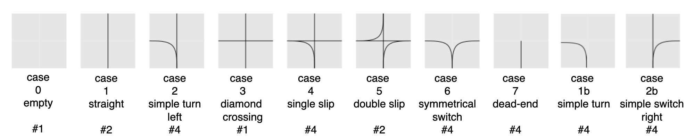
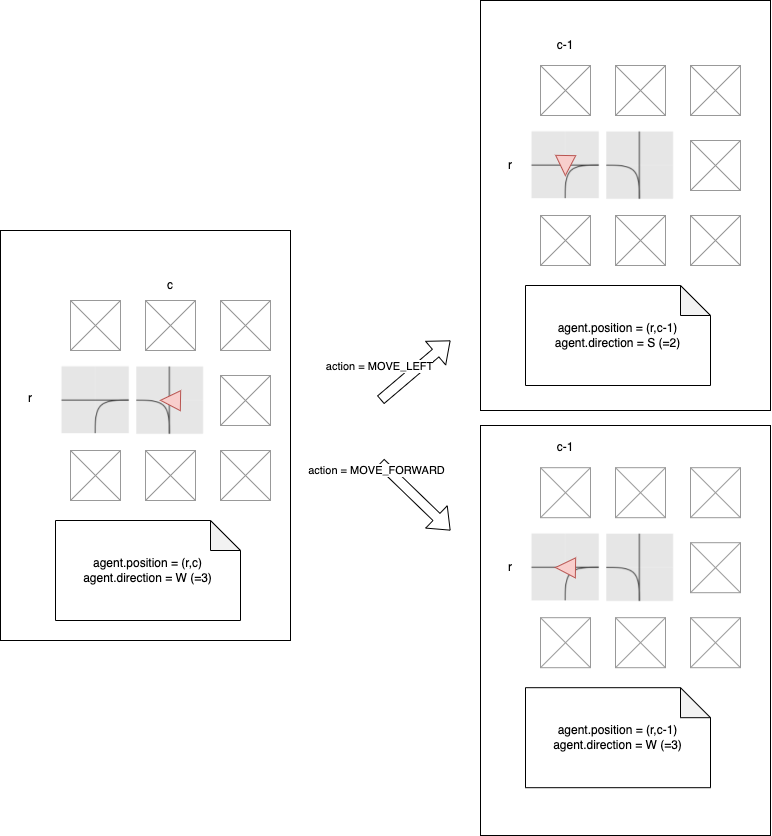

Flatland Environment
====================

The goal in Flatland is simple:

> **We seek to minimize the time it takes to bring all the agents to their respective target.**

This raises a number of questions:

- [**Environment**](#Environment) where are the agents?
- [**Actions:**](#actions) what can the agents do?
- [**Observations:**](#observations) what can each agent "see"?
- [**Rewards:**](#rewards) what is the metric used to evaluate the agents?

🗺️ Environment
---

Flatland is a 2D rectangular grid environment of arbitrary width and height, where the most primitive unit is a cell. Each cell has the capacity to hold a
single agent (train).

An agent in a cell can have a discrete orientation direction which represents the cardinal direction the agent is pointing to. An agent can move to a subset of
adjacent cells. The subset of adjacent cells that an agent is allowed to transition to is defined by a 4-bit transition map representing possible transitions in
4 different directions.



*10 basic cells modulo rotation enable us to implement any real-world railway network in the flatland env*
This gives a set of 30 valid transitions in total (see `#` giving number of rotations).

Agents can only travel in the direction they are currently facing. Hence, the permitted transitions for any given agent depend both on its position and on its
direction. Transition maps define the railway network in the flatland world. One can implement any real world railway network within the Flatland environment by
manipulating the transition maps of cells.

For more information on transtion maps checkout [environment information](../environment/environment_information)!


↔️ Actions
---

The trains in Flatland have strongly limited movements, as you would expect from a railway simulation. This means that only a few actions are valid in most
cases.

Here are the possible actions:

- **`DO_NOTHING`**:  If the agent is already moving, it continues moving. If it is stopped, it stays stopped. Special case: if the agent is at a dead-end, this
  action will result in the train turning around.
- **`MOVE_LEFT`**: This action is only valid at cells where the agent can change direction towards the left. If chosen, the left transition and a rotation of
  the agent orientation to the left is executed. If the agent is stopped, this action will cause it to start moving in any cell where forward or left is
  allowed!
- **`MOVE_FORWARD`**: The agent will move forward. This action will start the agent when stopped. At switches, this will chose the forward direction.
- **`MOVE_RIGHT`**: The same as deviate left but for right turns.
- **`STOP_MOVING`**: This action causes the agent to stop.

Flatland is a discrete time simulation, i.e. it performs all actions with constant time step. A single simulation step synchronously moves the time forward by a
constant increment, thus enacting exactly one action per agent per timestep.

```{admonition} Code reference
The actions are defined in [flatland.envs.rail_env.RailEnvActions](https://gitlab.aicrowd.com/flatland/flatland/blob/master/flatland/envs/rail_env.py#L69).

You can refer to the directions in your code using eg `RailEnvActions.MOVE_FORWARD`, `RailEnvActions.MOVE_RIGHT`...
```

The following diagram shows the interplay of agent position/direction and actions.

The agent (red triangle) is in left switch cell with direction `W`. The left neighbor cell is a left switch, too.
Upon entering the new cell, the `MOVE_LEFT` action will update the agent's direction to `S`, and the `MOVE_FORWARD` direction will keep the agent's direction at
`W`.



> *Pro memoria*
>
> **current position and direction** determine **next cell**
>
> **action** determines **next direction**

### 💥 Agent Malfunctions

Malfunctions are implemented to simulate delays by stopping agents at random times for random durations. Train that malfunction can’t move for a random, but
known, number of steps. They of course block the trains following them 😬.

👀 Observations
---

In Flatland, you have full control over the observations that your agents will work with. Three observations are provided as starting point. However, you are
encouraged to implement your own.

The three provided observations are:

- Global grid observation
- Local grid observation
- Tree observation


***Global, local and tree:** A visual summary of the three provided observations.*

**[🔗 Provided observations](environment/observations)**

```{admonition} Code reference
The provided observations are defined in [envs/observations.py](https://gitlab.aicrowd.com/flatland/flatland/blob/master/flatland/envs/observations.py)
```

Each of the provided observation has its strengths and weaknesses. However, it is unlikely that you will be able to solve the problem by using any single one of
them directly. Instead you will need to design your own observation, which can be a combination of the existing ones or which could be radically different.

**[🔗 Create your own observations](../environment/custom_observations)**


🌟 Rewards
----------

In **Flat**land 3, rewards are only provided at the end of an episode by default making it a sparse reward setting.

The episodes finish when all the trains have reached their target, or when the maximum number of time steps is reached.

The actual reward structure has the following cases:

- **Train has arrived at it's target**: The agent will be given a reward of 0 for arriving on time or before the expected time. For arriving at the target later
  than the specified time, the agent is given a negative reward proportional to the delay.
  `min(latest_arrival - actual_arrival, 0 )`

- **The train did not reach it's target yet**: The reward is negative and equal to the estimated amount of time needed by the agent to reach its target from
  it's current position, if it travels on the shortest path to the target, while accounting for it's latest arrival time.
  `agent.get_current_delay()` *refer to it in detail [here](../environment/timetables)*
  The value returned will be positive if the expected arrival time is projected before latest arrival and negative if the expected arrival time is projected
  after latest arrival. Since it is called at the end of the episode, the agent is already past it's deadline and so the value will always be negative.

- **The train never departed**: If the agent hasn't departed (i.e. status is `READY_TO_DEPART`) at the end of the episode, it is considered to be cancelled and
  the following reward is provided.
  `-1 * cancellation_factor * (travel_time_on_shortest_path + cancellation_time_buffer)`

```{admonition} Code reference
The reward is calculated in [envs/rail_env.py](https://gitlab.aicrowd.com/flatland/flatland/blob/master/flatland/envs/rail_env.py)
```

🚉 Other concepts
-----------------

### Stochasticity

An important aspect of these levels will be their **stochasticity**, which means how often and for how long trains will malfunction. Malfunctions force the
agents the reconsider their plans which can be costly.

**[🔗 Adjust stochasticity](../environment/stochasticity)**

### Speed profiles

Finally, trains in real railway networks don't all move at the same speed. A freight train will for example be slower than a passenger train. This is an
important consideration, as you want to avoid scheduling a fast train behind a slow train!

**[🔗 Tune speed profiles](../environment/speed_profiles)**