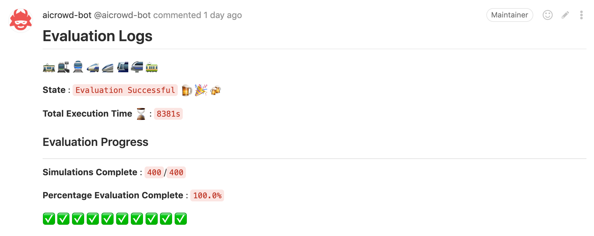

Submit in 5 Minutes
===

🚂 All aboard!
---

In the next five minutes, you will submit your first agent to the [NeurIPS 2020 Flatland Challenge](https://www.aicrowd.com/challenges/neurips-2020-flatland-challenge/) and will see your name on the leaderboard.


📦 Setup
---

### Starter Kit

Start by cloning the starter kit: 

```console
$ git clone https://gitlab.aicrowd.com/flatland/neurips2020-flatland-starter-kit.git/
$ cd flatland-challenge-starter-kit
```

The starter kit comes with a sample agent which performs random actions. We will see how it works in more details in the last section.

### Setup conda

Flatland uses the conda package manager. If you use macOS or Linux, you can simply [install conda](https://www.anaconda.com/products/individual) if needed. The next steps show how to set it up with Windows.

### Extra steps on Windows

This is for Windows users only!

1. Enable [WSL](https://docs.microsoft.com/en-us/windows/wsl/install-win10) on Windows.
2. Get [Ubuntu](https://www.microsoft.com/en-us/p/ubuntu/9nblggh4msv6?SilentAuth=1&wa=wsignin1.0&activetab=pivot:overviewtab) for Windows.
3. Run your **Ubuntu** system on your computer
4. Now let us install the **Dependencies**. From within the **Ubuntu-Shell** run:

First download **Anaconda**  by running this in the **Ubuntu Shell**:

```{warning}
You need the **Linux** version and not Windows version!
```

```console
$ wget https://repo.anaconda.com/archive/Anaconda3-2019.07-Linux-x86_64.sh 
```

Install **Anaconda** for Ubuntu:

```console
$ chmod +x Anaconda3-2019.07-Linux-x86_64.sh 
$ ./Anaconda3-2019.07-Linux-x86_64.sh 
```

You may have to restart Ubuntu for all changes to take effect.

### Create the conda environment

You can now run the following:

```console
$ conda env create -f environment.yml # creates the flatland-rl environment
$ conda activate flatland-rl # activates it
```


✅ Test your local setup
---

We will now run the agent locally to check that everything works as expected.

Let's download a few test environments. Head to the [challenge resources](https://www.aicrowd.com/challenges/neurips-2020-flatland-challenge/dataset_files) and download the provided test set. Untar them in `./scratch/test-envs`. 

Your directory structure should be as follow:

```
./scratch
└── test-envs
    ├── Test_0
    │   ├── Level_0.pkl
    │   └── Level_1.pkl
    ├── Test_1
    │   ├── Level_0.pkl
    │   └── Level_1.pkl
    ├── Test_2
    │   ├── Level_0.pkl
    │   └── Level_1.pkl
    ├── Test_3
    │   ├── Level_0.pkl
    │   └── Level_1.pkl
    ├── ...
``` 

We will now replicate the setup used on AIcrowd locally to ensure that your submission will be evaluated without problem when you submit it. 
This involves three components: your agent, the evaluator service, and a Redis server to let them communicate. 

#### Redis

The communication between your agent and the evaluator is done through a Redis server. You should ensure that a redis server is running on localhost. Follow [these instructions](https://redis.io/topics/quickstart) to set it up.

You can check that things are ready by running:

```console
$ redis-cli ping
PONG
```

#### Evaluator service

Let's start the evaluator service. You should use different terminals for the evaluator and the agent as they will need to run at the same time.

```bash
$ flatland-evaluator --tests ./scratch/test-envs/
```

#### The agent

You can now start the agent:

```bash
$ # on Linux
$ export AICROWD_TESTS_FOLDER=./scratch/test-envs/
$ # or on Windows :
$ #  SET AICROWD_TESTS_FOLDER=./scratch/test-envs/
$ python run.py
```

That's it! the agent should now start interacting with the evaluator, and you should see the results coming in.

```console
$ flatland-evaluator --tests ./scratch/test-envs/
['Test_12/Level_0.pkl', 'Test_1/Level_1.pkl', 'Test_10/Level_1.pkl', 'Test_11/Level_0.pkl', 'Test_8/Level_0.pkl', 'Test_4/Level_1.pkl', 'Test_2/Level_1.pkl', 'Test_5/Level_0.pkl', 'Test_7/Level_0.pkl', 'Test_6/Level_1.pkl', 'Test_3/Level_1.pkl', 'Test_7/Level_1.pkl', 'Test_9/Level_1.pkl', 'Test_10/Level_0.pkl', 'Test_6/Level_0.pkl', 'Test_2/Level_0.pkl', 'Test_11/Level_1.pkl', 'Test_0/Level_1.pkl', 'Test_0/Level_0.pkl', 'Test_9/Level_0.pkl', 'Test_4/Level_0.pkl', 'Test_13/Level_0.pkl', 'Test_12/Level_1.pkl', 'Test_8/Level_1.pkl', 'Test_3/Level_0.pkl', 'Test_5/Level_1.pkl', 'Test_13/Level_1.pkl', 'Test_1/Level_0.pkl']
Listening at :  flatland-rl::FLATLAND_RL_SERVICE_ID::commands
Evaluating : Test_12/Level_0.pkl
Evaluating : Test_1/Level_1.pkl
Evaluating : Test_10/Level_1.pkl
Evaluating : Test_11/Level_0.pkl
Evaluating : Test_8/Level_0.pkl
Evaluating : Test_4/Level_1.pkl
...
```

You don't have to let the evaluation run until the end, since right now it is just using a random agent. The goal is simply to check that everything works as expected. 

When you will start implementing your own agents, this will allow you to check that your solutions are fully working. Note that submissions that don't work still count against your daily limit! 😱

```{admonition} Why so complicated?
This client/server architecture is used to fully isolate submissions from the evaluation infrastructure.
```

🗂️ Code structure
---

Here's how to organize your code to ensure the evalution will work successfully.

### Repository Structure

Each repository must have an `aicrowd.json` file with the following content :

```json
{
  "challenge_id": "neurips-2020-flatland-challenge",
  "grader_id": "neurips-2020-flatland-challenge",
  "description": "Optional description of your agent",
  "debug": true
}
```

This is used to map your submission to the proper challenge, so please remember to use the correct `challenge_id` and `grader_id` as specified above.

If you set `debug` to `true`, then the evaluation will run on a separate set of 28 environments, and the logs from your submitted code (if it fails), will be made available to you to help you debug. These test submissions won't count against your daily limit and won't appear on the leaderboard.

```{warning}
By default we have set `debug: true`, so when you have done the basic integration testing of your code, and are ready to make a final submission, please make sure to set `debug: false` in `aicrowd.json`.
```

### Code Entrypoint

The evaluator will use `/home/aicrowd/run.sh` as the entrypoint, so please remember to have a `run.sh` at the root, which can instantiate any necessary environment variables, and also start executing your actual code. This repository includes a sample `run.sh` file.

If you are using a Dockerfile to specify your software environment, please remember to create an `aicrowd` user, and place the entrypoint code at `run.sh`. If you are unsure what this is all about, you can let `run.sh` be as is, and instead focus on the `run.py` which is being called from within `run.sh`!

📤 Submitting!
---

Let's first consider the big picture. To submit to the challenge, you'll need to ensure you've set up an appropriate repository structure, create a private git repository at [gitlab.aicrowd.com](https://gitlab.aicrowd.com/) with the contents of your submission, and push a git tag corresponding to the version of your repository you'd like to submit. You are allowed to submit up to 5 submissions per day.

#### Create your repository

Head to [gitlab.aicrowd.com](https://gitlab.aicrowd.com) to create your private repository. You can use any name you want for it.

Add your SSH Keys to your GitLab account by following [these instructions](https://docs.gitlab.com/ee/gitlab-basics/create-your-ssh-keys.html). If you do not have SSH Keys, you will first need to [generate a pair](https://docs.gitlab.com/ee/ssh/README.html#generating-a-new-ssh-key-pair).

#### Push a tag

You can then create a submission by making a **tag push** to your repository on [gitlab.aicrowd.com](https://gitlab.aicrowd.com/).

First add a git remote pointing to your repository on [gitlab.aicrowd.com](https://gitlab.aicrowd.com/):

```console
$ # change the line below to use your AIcrowd username and repository name:
$ git remote add aicrowd git@gitlab.aicrowd.com:<YOUR_AICROWD_USER_NAME>/<YOUR_REPO_NAME>.git
$ git push aicrowd master
```

Finally submit your solution by creating a tag for your submission and pushing it:

```console
$ git tag submission-v0.1 # needs a new name tag for each submission!
$ git push aicrowd master
$ git push aicrowd submission-v0.1
```

```{admonition} Submission tags
Any tag push where the tag name begins with "submission-" to your private repository is considered as a submission!
Remember that you are allowed up to 5 submissions per day.
```

Note that if the content of your repository (latest commit hash) does not change, then pushing a new tag will **not** trigger a new evaluation.

You now should be able to see the details of your submission at:

[https://gitlab.aicrowd.com/<YOUR_AICROWD_USER_NAME>/<YOUR_REPO_NAME>/issues](#)

At the address above above, you should start seeing something like this take shape. The whole evaluation can take a bit of time, you will have to be patient! 🕙



🚉 Next stops
---

Take a look at the [agent provided in the starter kit](https://gitlab.aicrowd.com/flatland/neurips2020-flatland-starter-kit/blob/master/run.py#L21). It simply takes random actions at every timestep. Surely you can do better 💪

It is now time to start improving the agent! Head over to the [reinforcement learning in Flatland introduction](rl) to get started with simple RL methods such as DQN. To go further, explore the [research baselines](../research/baselines) which use RLlib to train using advanced algorithms such as Ape-X, PPO or imitation learning methods such as MARWIL.

🐛 Troubleshooting
---

### "unknown locale: UTF-8"

This happens on macOS. Append this to your `~/.bash_profile`:

```console
$ export LC_ALL=en_US.UTF-8
$ export LANG=en_US.UTF-8
```

And then run:

```console
$ source ~/.bash_profile
```

[More details](https://stackoverflow.com/a/38917471/318557)

### "activate is not a conda command"

This error can have various causes. Most commonly, this means that your conda installation is either too old, or misconfigured in some way. The easiest fix is to update conda to the latest version and re-install it if it keeps failing.