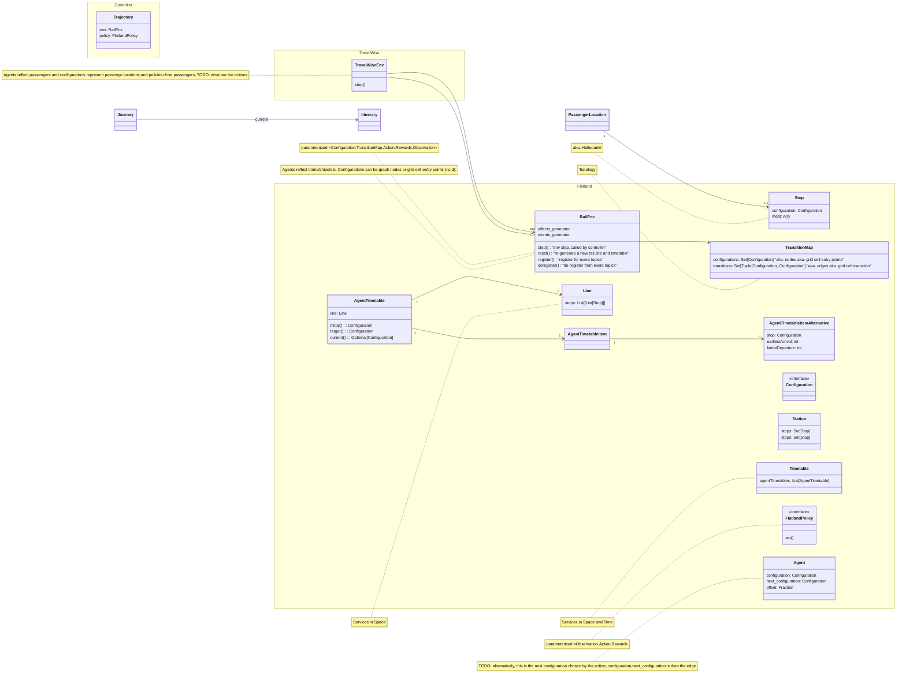

Flatland Data Model
===================

## Building Blocks

Flatland represents RL view of the world: agent policies act on the env upon receiving a (partial) observation of the env state.
The world is run by a controller loop and the run is collected in a trajectory.

External effects can be modelled by effects generators, modifying the environment state before or after an env step, reflecting e.g.

- random disruptions of trains (due to door not closing, passenger delaying departure etc.)
- availability of infrastructure (e.g. opening a passenger fast-lane at airports)

The railway domain is reflected at the microscopic level:

* infrastructure/topology is defined by the transition map and stations and stops in the map
* services are defined spatially by lines and spatio-temporally by timetables

The TravelWise extension reflects passenger journeys. Technical, it is an extension of RailEnv, but also refers to an underlying RailEnv where trains, ships
etc. run.



## JSON Representation

https://github.com/flatland-association/flatland-rl/issues/129

### Environment State

```json
{
  "meta": {
    "version": 0.1,
    "type": "Flatland Digiial Environment State"
  },
  "rail": {
    "topology": {
      "type": grid
      or
      graph,
      "configuration": {
        type-dependent
        representation
      }
    },
    "stations": {
      todo
      details
    },
    "lines": [
      {
        "waypoints": [
          for
          all
          lines
          list
          of
          waypoints
          with
          flexibility
        ]
        "stations": [
          {
            "rail_elements": [],
            "
          }
        ]
      }
    ],
    "timetable": [
      {
        "earliest": int,
        "latest": int
      }
    ],
    "agents": {
      "position": position/direction/counter
      or
      edge/offset,
      "max_speed": float [
  0,
  1
]
"speed": float [0, 1]
"malfunction": int
"state": enum
"line": },
"internal": {
"elapsed_steps": int,
}
}
```

### Environment Configuration

```json
{
  "meta": {
    "version": 0.1,
    "type": "Flatland Digitial Environment Configuration"
  },
  "reset_generators": {
    "rail": {
      "type": Python
      class
      or
      identifier
      to
      be
      more
      refactoring
      safe,
      "configuration": kwargs
    },
    "line": {},
    "timetable": {}
  },
  "effects_generators": [
    {
      "including malfunction"
    }
  ],
  "rewards": {
    "type": fully-qualified
    class
    or
    identifier,
    "configuration": kwargs
  },
  "params": {
    "acceleration_delta": 1.0,
    "braking_delta": -1.0,
    "observation_builder": type
    with
    no
    args
    state
    to
    any,
    "info_builder": type
    with
    no
    args
    state
    to
    dict
    "remove_agents_at_target": True,
    "max_episode_steps"
  }
}
```

## Open Questions

- Term journey?
- Term itinerary?
- Term/concept milestones?
- Term/concept connection?
- actions in TravelWiseEnv?
- controller output not only defines next configuration
- stats level?
- detail add effects generators and events
- detail harmonize data model with math formulation
- Do we need concept of Intention/chosen path? Where? How represented? Is this itinerary
- update JSON according to class view
