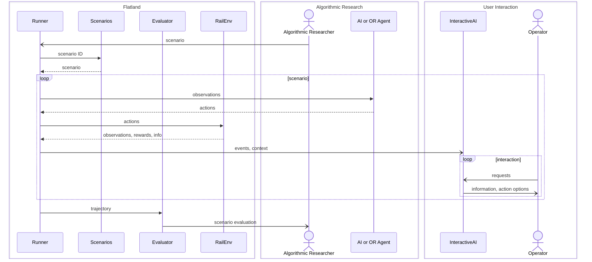
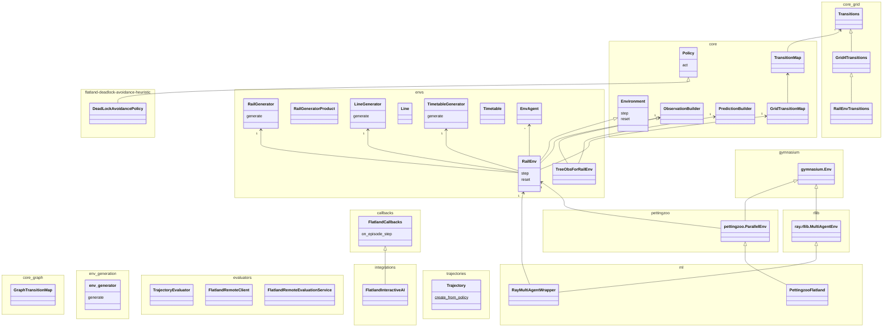
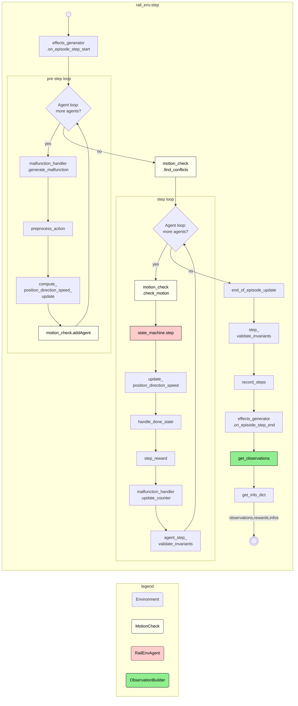
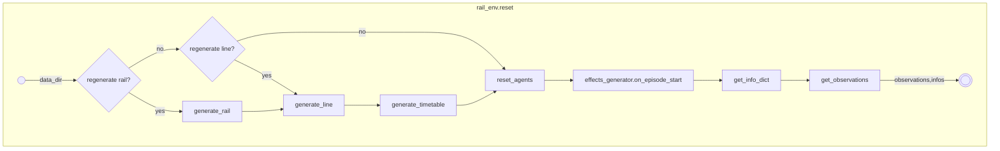

Key Concepts
============
To help you get a high-level understanding of how the Flatland works, on this page, you learn about the key concepts and general architecture.

We use the terms from [arc42](https://docs.arc42.org/section-7/) for the different views.

[//]: # (icon-park icons from  &#40;https://icones.js.org/collection/icon-park&#41;)

Flatland Code Repositories
--------------------------

* [**flatland-rl**](https://github.com/flatland-association/flatland-rl) contains the environment and evaluation code
* [**flatland-baselines**](https://github.com/flatland-association/flatland-baselines) contains baseline controllers/agents
* [**flatland-scenarios**](https://github.com/flatland-association/flatland-scenarios) contains scenarios for illustration, regression testing and benchmarking
* [**flatland-book**](https://github.com/flatland-association/flatland-book) contains the source code for this documentation

Context View
------------

Notation: [Mermaid Architecture Diagram](https://mermaid.js.org/syntax/architecture.html)

```mermaid
architecture-beta
group flatland(ip:railway)[Flatland]
group ai(ip:brain)[Algorithmic Research]
group ui(ip:data-user)[User Interaction]

service algorithmicResearcher(ip:user)[Algorithmic Researcher] in ai
service evaluator(ip:checklist)[Evaluator] in flatland
service runner(ip:refresh-one)[Runner] in flatland

service railEnv(ip:train)[RailEnv] in flatland
service scenarios(ip:database-config)[Scenarios] in flatland
service policy(ip:six-circular-connection)[AI or OR Agent] in ai
service interactiveAI(ip:map-two)[InteractiveAI] in ui
service operator(ip:user)[Operator] in ui

algorithmicResearcher:B -- T:runner
algorithmicResearcher:B -- T:evaluator
runner:R -- L:railEnv
runner:L -- R:evaluator
scenarios:T -- B:runner
railEnv:T -- B:policy
railEnv:R -- L:interactiveAI
interactiveAI:R -- L:operator
```

High-Level Runtime View
-----------------------

Notation: [Mermaid Sequence Diagram](https://mermaid.js.org/syntax/sequenceDiagram.html)

Building Block View
-------------------

Notation: [Mermaid Class Diagram](https://mermaid.js.org/syntax/classDiagram.html)

Runtime View RailEnv Step
-------------------------

Notation: [Mermaid Sequence Diagram](https://mermaid.js.org/syntax/sequenceDiagram.html)

| step                                     | description                                                                                                                                                                                                                                                                                                                                             |
|------------------------------------------|---------------------------------------------------------------------------------------------------------------------------------------------------------------------------------------------------------------------------------------------------------------------------------------------------------------------------------------------------------|
| effects_generator.on_episode_step_start  | Hook for external events modifying the env (state) before observations and rewards are computed.                                                                                                                                                                                                                                                        |
| malfunction_handler.generate_malfunction | Draw malfunctions                                                                                                                                                                                                                                                                                                                                       |
| preprocess_action                        | 1. Change to DO_NOTHING if illegal action (not one of the defined action);   2. Check MOVE_LEFT/MOVE_RIGHT actions on current position else try MOVE_FORWARD;    3. Change to STOP_MOVING if the movement is not possible in the grid (e.g. if MOVE_FORWARD in a symmetric switch or MOVE_LEFT in straight element or leads outside of bounds). |
| compute_position_direction_speed_update  | Based on preprocessed action and current state, compute next position/direction/speed unilaterally.                                                                                                                                                                                                                                                     |
| motion_check.addAgent                    | Register the new position/direction with the MotionCheck conflict resolution.                                                                                                                                                                                                                                                                           |
| motion_check.find_conflicts              | Find and resolve conflicts.                                                                                                                                                                                                                                                                                                                             |
| motion_check.check_motion                | Check whether the next position/direction is possible given the other agents' desired updates.                                                                                                                                                                                                                                                          |
| state_machine.step                        | With MotionCheck's decision for this agent, do agent state machine transition.                                                                                                                                                                                                                                                                          |
| update_position_direction_speed          | Based on the new state, update position/direction/speed.                                                                                                                                                                                                                                                                                                |
| handle_done_state                        | Based on the new position, check whether target is reached and remove agent if `remove_agents_at_target` is set in the env.                                                                                                                                                                                                                             |
| step_reward                              | Compute step rewards.                                                                                                                                                                                                                                                                                                                                   |
| malfunction_handler.update_counter       | Update current malfunctions.                                                                                                                                                                                                                                                                                                                            |
| agent_step_validate_invariants           | Validate invariants at agent level, in particular check for whether on map and off map states are matching with position being None                                                                                                                                                                                                                     |
| end_of_episode_update                    | Have all agents terminated?                                                                                                                                                                                                                                                                                                                             |
| step_validate_invariants                 | Validate overall  invariants, in particular verify that no two agents occupy the same cell (apart from level-free diamond crossings).                                                                                                                                                                                                                   |
| record_steps                             | Records steps.                                                                                                                                                                                                                                                                                                                                          |
| effects_generator.on_episode_step_end    | Hook for external events modifying the env (state) before observations and rewards are computed.                                                                                                                                                                                                                                                        |
| get_observations                         | Call observation builder for all agents.                                                                                                                                                                                                                                                                                                                |
| get_info_dict                            | Prepare infos for all agents.                                                                                                                                                                                                                                                                                                                           |

Runtime View Env Reset
----------------------

Notation: [Mermaid Sequence Diagram](https://mermaid.js.org/syntax/sequenceDiagram.html)

