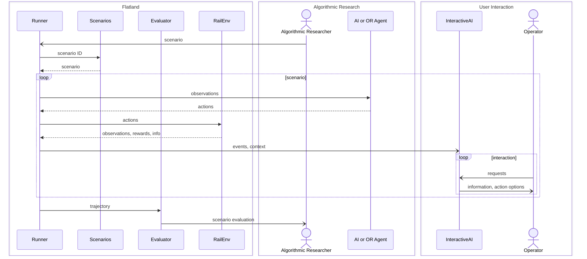
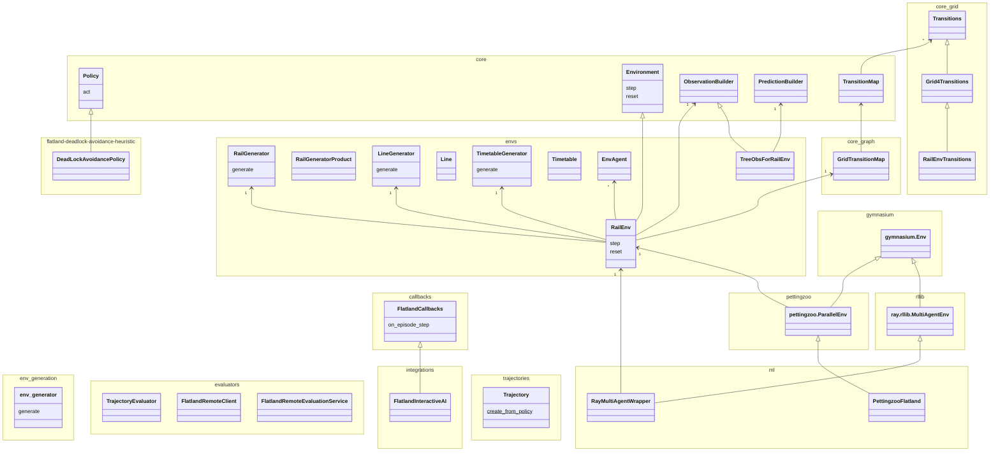
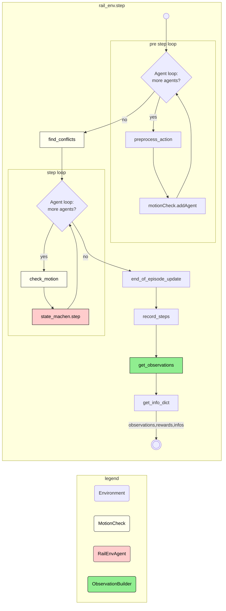
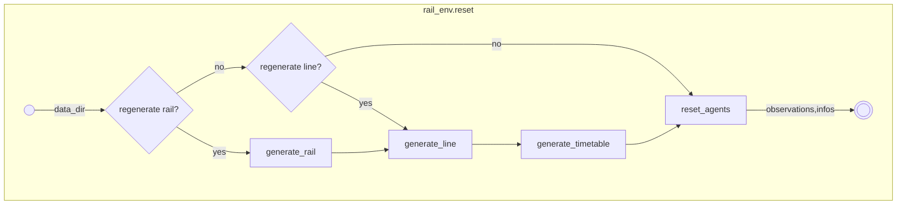

Key Concepts
============
To help you get a high-level understanding of how the Flatland works, on this page, you learn about the key concepts and general architecture.

We use the terms from [arc42](https://docs.arc42.org/section-7/) for the different views.

[//]: # (icon-park icons from  &#40;https://icones.js.org/collection/icon-park&#41;)

Context View
------------

Notation: [Mermaid Architecture Diagram](https://mermaid.js.org/syntax/architecture.html)

```mermaid
architecture-beta
group flatland(ip:railway)[Flatland]
group ai(ip:brain)[Algorithmic Research]
group ui(ip:data-user)[User Interaction]

service algorithmicResearcher(ip:user)[Algorithmic Researcher] in ai
service evaluator(ip:checklist)[Evaluator] in flatland
service runner(ip:refresh-one)[Runner] in flatland

service railEnv(ip:train)[RailEnv] in flatland
service scenarios(ip:database-config)[Scenarios] in flatland
service policy(ip:six-circular-connection)[AI or OR Agent] in ai
service interactiveAI(ip:map-two)[InteractiveAI] in ui
service operator(ip:user)[Operator] in ui

algorithmicResearcher:B -- T:runner
algorithmicResearcher:B -- T:evaluator
runner:R -- L:railEnv
runner:L -- R:evaluator
scenarios:T -- B:runner
railEnv:T -- B:policy
railEnv:R -- L:interactiveAI
interactiveAI:R -- L:operator
```

High-Level Runtime View
-----------------------

Notation: [Mermaid Sequence Diagram](https://mermaid.js.org/syntax/sequenceDiagram.html)

Building Block View
-------------------

Notation: [Mermaid Class Diagram](https://mermaid.js.org/syntax/classDiagram.html)

Runtime View RailEnv Step
-------------------------

Notation: [Mermaid Sequence Diagram](https://mermaid.js.org/syntax/sequenceDiagram.html)

Runtime View Env Reset
----------------------

Notation: [Mermaid Sequence Diagram](https://mermaid.js.org/syntax/sequenceDiagram.html)

