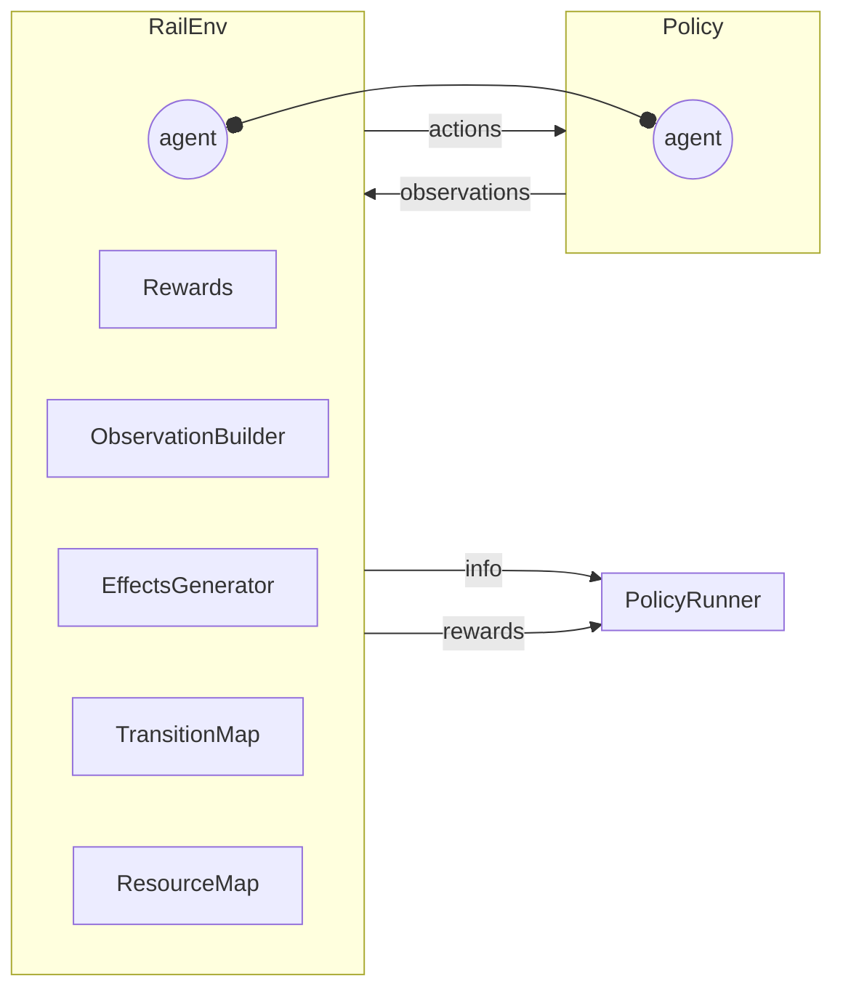
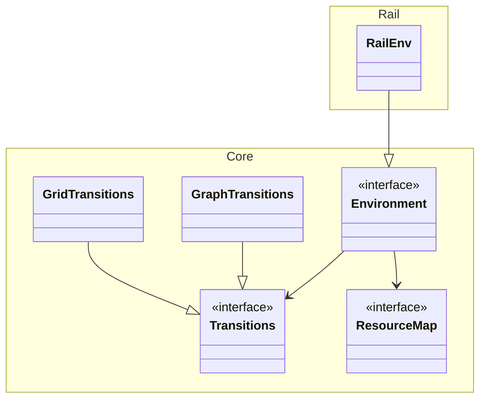

# Flatland Data and Simulation Model

## Overview

The following digram shows the RL control loop,

```python
obs, rewards, dones, info = env.step(action_dict)
```

showing the flow of inputs and outputs of `step`:



Adapted from [RLlib](https://docs.ray.io/en/latest/rllib/rllib-env.html#rllib-environments-doc).

## Glossary

### Flatland Environment

| Concept             | Description                                                                                                                                                                                                                                                                |
| ------------------- | -------------------------------------------------------------------------------------------------------------------------------------------------------------------------------------------------------------------------------------------------------------------------- |
| Agent               | Each train is a single agent in Flatland.                                                                                                                                                                                                                                  |
| (MA)RL Loop         | (Multi-Agent) Reinforcement Learning Loop is a control loop: a policy receives observations from the env and outputs actions. See above.                                                                                                                                   |
| Policy              | Recevies an observation for each agent and outputs an action for each agent. The policy may consist of a single sub-policy applied to each agent unilaterally or it may have different sub-policies for each agent individually or even consider all observations jointly. |
| Policy Runner       | Takes an env and a policy and runs the MARL loop for evaluation by calling `obs, rewards, dones, info = env.step(action_dict)` iteratively until done.                                                                                                                     |
| Callbacks           | Callbacks for start/end of trajectory and start/end of env step, called by policy runner.                                                                                                                                                                                  |
| Trajectory          | The output of a policy run: actions, positions, rewards.                                                                                                                                                                                                                   |
| Actions             | An action for each agent.                                                                                                                                                                                                                                                  |
| Rewards             | A reward (number or dict) for each agent. Also used for the component building the rewards during `step`.                                                                                                                                                                  |
| Effects Generator   | Called before and after an env `step` to modify the env's state, e.g. injecting disruptions.                                                                                                                                                                               |
| Observation Builder | Called by env to build the observation from the env's state.                                                                                                                                                                                                               |
| Configuration       | Each agent is in a configuration, e.g. its position on the grid or in the graph. Updated by env during a `step`.                                                                                                                                                           |
| Transition Map      | Defines the topology the agents live in, i.e. the configurations and transitions between configuration as well as actions required for the transition.                                                                                                                     |
| Resource Map        | Defines which resources are used by the topology elements, e.g. rails can be allocated only mutually exclusively. Currently, each topology element requires exactly one resource.                                                                                          |



### Flatland Transition Maps

| Concept        | Grid                                                                | Graph                                                                                                                       |
| -------------- | ------------------------------------------------------------------- | --------------------------------------------------------------------------------------------------------------------------- |
| Coordinate     | Row, column, direction how cells can be entered.                    | An abstract **node** without further structure.                                                                             |
| Transition Map | For each coordinate, which are possible successor coordinates.      | A pair of **node**s defines a directed **edge**.                                                                            |
| Configuration  | Coordinate, next coordinate, offset, speed, malfunction_counter     | Edge, offset.                                                                                                               |
| Resource Map   | Each `row,col=cell` is a mutually exclusively allocatable resource. | A group of edges may require the same mutually exclusively allocatable resource, reflecting common physical infrastructure. |

In Flatland 4.2.5, configurations are `((r,c),d)`; renaming to `coordinate` planned for 4.3.0.

### Flatland Rail

| Concept               | Description                                                                                                                                                                                                                                                                |
| --------------------- | -------------------------------------------------------------------------------------------------------------------------------------------------------------------------------------------------------------------------------------------------------------------------- |
| Malfunction Generator | An instance of effects generator, changing agent's state.                                                                                                                                                                                                                  |
| Rail (Generator)      | Outputs a transition map and stopping points, and, optionally, stations and links.                                                                                                                                                                                         |
| Line (Generator)      | Outputs a sequence of stops, which are sets of configurations. The first is a singleton called initial configuration; the last is called target; the others are called intermediate stops.                                                                                 |
| Timetable (Generator) | Adds a time window (earliest, latest) for each stop. Earliest of the initial configuration is enforced by the simulation (putting the agent's state to ready to depart in the env); the remaining are used in the rewards for penalizing early arrivaly or late departure. |
| Station               | Collection of stopping points and gates.                                                                                                                                                                                                                                   |
| City                  | In sparse rail generator, internally used alias for station.                                                                                                                                                                                                               |
| Stopping Point        | "Bahnhofsmitte" configurations where agents can stop.                                                                                                                                                                                                                      |
| Gate                  | A collection of pins.                                                                                                                                                                                                                                                      |
| Link                  | Connects two gates. Has fibres. Not all pairs of pins in the gate need be connected.                                                                                                                                                                                       |
| Fibre                 | A sequence of transitions linking two pins of a link.                                                                                                                                                                                                                      |
| Pin                   | A single configuration attached to a gate.                                                                                                                                                                                                                                 |
| Chain                 | A sequence of links terminating/starting at the same station at different reachable gates.                                                                                                                                                                                 |
