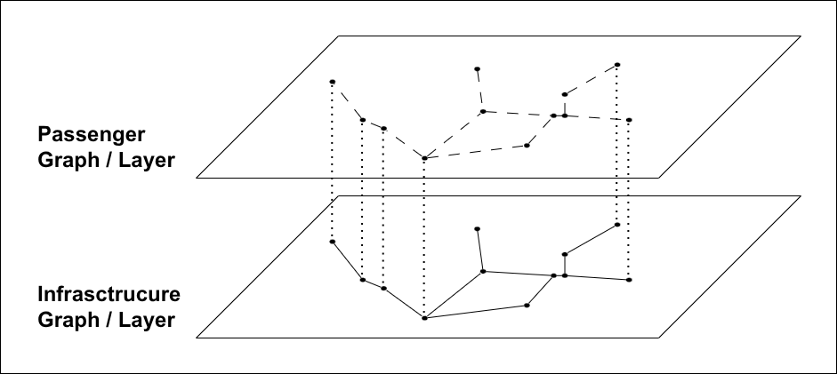
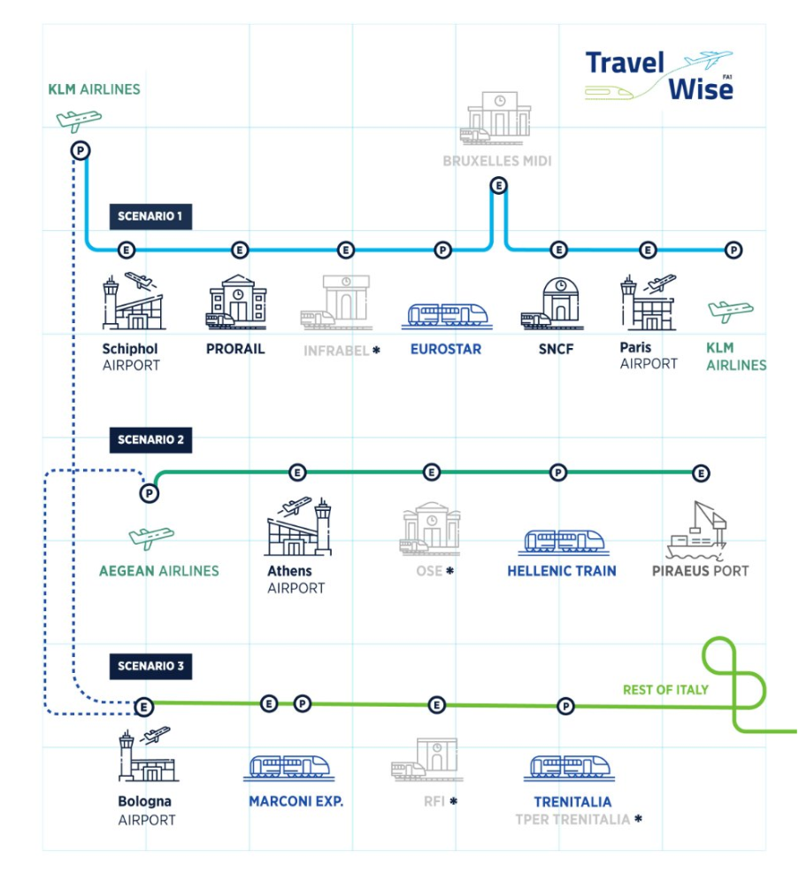

# Travel Wise

The goal of the [Travel Wise project](https://travelwise-project.eu/) is to improve intermodal coordination and common situational awareness to enable seamless travel across transport modes.

These core ideas will be implemented in Flatland to enable the simulation of Travel Wise sceanrios:

- Multimodality: move from trains-only to other modes of transport (busses, airplanes, ships and ferries, ...)
- Passenger journey: agents can also be people travelling from A to B potentially using multiple modes of transportation
- Graph representation: move from the grid-world to a graph-world in a two-layered representation of an infrastructure-graph and a passenger-graph

## Introduction

The Flatland framework represents a systemic view of a given infrastructure map which is used for dispatching and (re-)routing of trains. With the Travel Wise extensions, a traveller's point of view as well as multimodal travel is introduced. With these extensions the concept of connecting trains and other modes of transportation is introduced alongside new terminology explained in the table below.

| term      | description                                                                                                                                                                                      |
| --------- | ------------------------------------------------------------------------------------------------------------------------------------------------------------------------------------------------ |
| journey   | A journey is a travel from point A to point B using potentially different modes of transportation.                                                                                               |
| Itinerary | The itinerary describes the planned route (space and time) for a given journey. The initial itinerary might be updated during the scenario according to a given metric (default: shortest time). |
| Transfer  | Each change of mode of transportation is a transfer, even if the mode is the same, e.g. from one train to another.                                                                               |

## High-Level Description

The Travel Wise extensions to the Flatland framework enable to simulate passenger journeys using multiple (different) modes of transportation with corresponding transfers between the different legs of the journey. On such a journey, different milestones are passed. Passing these milestones triggers communication with a top-layer. This communication layer is the Travel Wise solution (cf. [Travel Wise project](https://travelwise-project.eu/)) and is above and outside Flatland. Travel Wise extensions to Flatland include definition of milestones, the information collected at these events and an implementation to send out these messages to the external layer.

These extensions are realized using a graph representation of the **infrastructure** as a **ground level**. On this level, the agents are trains, buses, plains, etc. (_walkway_ is also considered a mode of transportation). As a first implementation, agents on this level run "on auto-pilot" and have no notion of passengers, cargo or capacities.

On the **passenger level**, the agents are groups of people (N=1..n) referred to as _passenger_. Each passenger has its own passenger graph on this level corresponding to a subgraph of the infrastucture graph (see below).

A passener, therefore, _hops on_ a vehicle running on the infrastructure layer. On each node of the graph where a transfer is possible (stations, stops, airports,...) the passenger _hops back up_ and _sees_ the possible paths on its own graph.

### Environments

The infrastructure layer corresponds to a generalized version of the `RailEnv` named `InfrastructureEnv`. It is a graph representation of the infrastructure with different transportation modes as properties of the edges. An edge that can only be travelled by foot, i.e. a walkway, is also included in the infrastructure graph.

The passenger layer is represented as a `PassengerEnv` where all properties correspond to those of the `InfrastructureEnv` (inheritance in OO terms), but the `PassengerEnv` depends on an existing `InfrastructureEnv` to be generated. The following table provides an overview of the properties. Both `InfrastructureEnv` and `PassengerEnv` together constitute a `TravelWiseEnv`.

| `InfrastructureEnv` | description                                                                                                                                                                                                  | `PassengerEnv`    | description                                                                                                                                                                                                                                            |
| ------------------- | ------------------------------------------------------------------------------------------------------------------------------------------------------------------------------------------------------------ | ----------------- | ------------------------------------------------------------------------------------------------------------------------------------------------------------------------------------------------------------------------------------------------------ |
| infrastructure      | graph consisting of nodes and multimodal edges                                                                                                                                                               | ...               | (the graph corresponds to a subgraph of the infrastructure graph)                                                                                                                                                                                      |
| line                | list of stations that are served successively                                                                                                                                                                | journey           | two points (origin and destination) that are connected through the graph                                                                                                                                                                               |
| timetable           | list of time windows (latest arrival, earliest departure) for a given line                                                                                                                                   | initial itinerary | list of specific modes of transport creating a viable path from origin and destination taking into account their timetables                                                                                                                            |
| action              | generalized version of the railway case actions, including _move to edge a1_, _accelerate_, _brake_ (this is a larger action space, since there can be more than two outgoing edges at a node (left, right)) | action            | in principle, there are the same actions, however, in practice there is only _move to edge a1_ since the passenger agents leave their graph as soon as they _hop on_ a vehicle (they still exist, but refer to their vehicle in the environment state) |
| observation         | conventional `RailEnv` observations, e.g. tree observation                                                                                                                                                   | observation       | global observation of the infrastructure graph and timetables; potentially a list of itineraries to choose from                                                                                                                                        |
| effect              | triggers for milestones can be e.g. delayed trains, trains passing a specific node, ...                                                                                                                      | effect            | triggers for milestones can be passenger specific, e.g. _my_ train is delayed, ...                                                                                                                                                                     |
| malfunction         | includes breakdowns, departure delays, ...                                                                                                                                                                   | -                 | so far, there are no malfunctions planned in this env                                                                                                                                                                                                  |

Note:
The infrastructure generator is a generalization of the rail generator. Likewise a generalization of timetable/itinerary generator to demand generator is envisaged and similarly for line/journey.

### Goals

The goal is to be able to simulate passenger journeys for a given scenario. A scenario includes both infrastructure with conditinal paths, i.e. edges on the infrastructure graph and schedules with optionally additional data.

### Use Cases

The general use cases are listed here. The Travel Wise scenarios from the project are listed below.

- Generate messages at milestones for a given infrastructure and journey.
- Create an itinerary for a passenger journey for a given infrastructure.
- Update an existing itinerary after a malfunction or delay using a given metric (default: shortest time).

### Data

The data needed to run a scenario:

- Infrastructure
- Optional paths and the conditions under which they can be used (e.g. shorter walkway for passengers with reduced mobility or fast tracking lanes for delayed passengers)
- Schedules of all modes of transportation
- Passenger journeys

Optional data for additional use cases:

- Capacities of (some) modes of transportation
- Additional infrastructure elements

### Requirements Simulation Model

Both layers need a controller and a policy under which the controller can act. The policies are different for the two layers. While on the infrastructure layer the policy is supposed to keep the system running, in the passenger layer it is responsible for finding the optimal itinerary for the passenger. Optimal can be different things, though. Examples include

- shortest time,
- fewest transfers,
- longer transfer times (e.g. for passengers with reduced mobility)

and can include instructions to, e.g., not update the itinerary at every decision point but only if the passenger is not able to stick to the initial itinerary.

## Travel Wise Scenarios

There are three Travel Wise scenarios where the first one is split into two parts.

1. **City Pair - Paris-Amsterdam**: Two international airports connected by plane or high-speed train (of wich most connections go trough Brussels).
   - Both Paris and Amsterdam are regarded as subscenarios connecting the airport with the interregional train station.
2. **International Hub - Athems**: Airport connected via train, bus and metro with port.
3. **Regional Airport - Bologna**: Airport connected via a monorail with interregional train station and city center.

### Data

In addition to the data needed for a general scenario (described above), a Travel Wise scenario also needs:

- Milestones

#### Qualitatively

#### Quantiatively ballpark numbers

### Scientific Questions

- What is the impact of a disruption and what are its cascading effects?
  - metrics include: total delay, number of passengers affected, number (and type) of vehicles affected, number of corrective measures implemented (like opening fast track lane)
- For a given disruption, is it worthwile to make alternative routes available for passengers?
  - metrics include: number of connections made possible thanks to new routes (measured by initial itineraries)

## Technical Description Data and Simulation Model

[Traval Wise Data Model](./travelwise/data_model.md)
