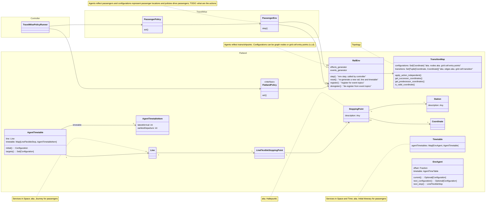

# Travel Wise Data Model

This page gives technical details to the general approach of [Travel Wise](../travelwise).

## Building Blocks

Flatland represents RL view of the world: agent policies act on the env upon receiving a (partial) observation of the env state.
The world is run by a controller loop and the run is collected in a trajectory.

External effects can be modelled by effects generators, modifying the environment state before or after an env step, reflecting e.g.

- random disruptions of trains (due to door not closing, passenger delaying departure etc.)
- availability of infrastructure (e.g. opening a passenger fast-lane at airports)

The railway domain is reflected at the microscopic level:

- infrastructure/topology is defined by the transition map and stations and stops in the map
- services are defined spatially by lines and spatio-temporally by timetables

The Travel Wise extension reflects passenger journeys.

Technically, it is an extension of RailEnv, but also refers to an underlying RailEnv where trains, ships
etc. run.

Travel Wise policy runner steps through the rail env by using an "auto-pilot" Flatland policy for the rail env and then a passenger policy to step the passenger
env, based on the observed new state of the rail env.
Agents controlled in rail env are vehicles, agents controlled in the passenger env are passengers.

