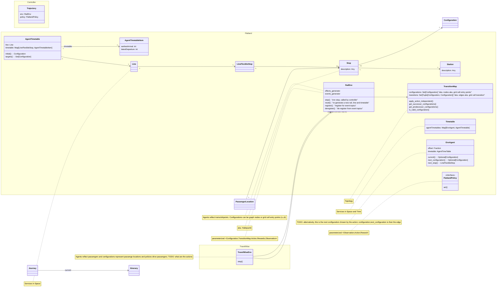

Travel Wise Data Model
===================

## Building Blocks

Flatland represents RL view of the world: agent policies act on the env upon receiving a (partial) observation of the env state.
The world is run by a controller loop and the run is collected in a trajectory.

External effects can be modelled by effects generators, modifying the environment state before or after an env step, reflecting e.g.

- random disruptions of trains (due to door not closing, passenger delaying departure etc.)
- availability of infrastructure (e.g. opening a passenger fast-lane at airports)

The railway domain is reflected at the microscopic level:

* infrastructure/topology is defined by the transition map and stations and stops in the map
* services are defined spatially by lines and spatio-temporally by timetables

The Travel Wise extension reflects passenger journeys. Technical, it is an extension of RailEnv, but also refers to an underlying RailEnv where trains, ships
etc. run.



## Interfaces and JSON Representation (WiP)

See https://github.com/flatland-association/flatland-rl/issues/129

### Environment State

Defines the state deterministically, including random state, so setting the state and stepping gives commutatively the same state.
(Obviously, this definition is only necessary, but not sufficient - single `None` state would satisfy this definition.)

```python
from abc import abstractmethod, ABCMeta
from typing import TypeVar, Generic

T = TypeVar('T')


class Persistable(Generic[T]):
    def save(self, path):
        ...

    @staticmethod
    def load(self, path) -> T:
        ...


State = TypeVar('State', covariant=True)


class Environment(Persistable[State], metaclass=ABCMeta):
    @abstractmethod
    def __getstate__(self) -> State:
        ...

    def __setstate__(self, state: State):
        ...


class EnvState(Persistable["EnvState"]):

    @property
    def get_configuration(self) -> "EnvConfiguration":
        ...


if __name__ == '__main__':
    some_env = ...
    some_seed = ...
    any_other_env = ...
    some_actions = ...
    some_env.reset(some_seed)

    any_other_env.__setstate__(some_env.__getstate__())
    assert any_other_env.__getstate__() == some_env.__getstate__()

    some_env.step(some_actions)
    any_other_env.step(some_actions)

    assert any_other_env.__getstate__() == some_env.__getstate__()

    some_env.reset(some_seed)
    any_other_env.reset(some_seed)

    assert any_other_env.__getstate__() == some_env.__getstate__()
```

```json
{
  "meta": {
    "version": 0.1,
    "type": "Flatland Digital Environment State"
  },
  "random_state": {},
  "rail": {},
  "stations": {},
  "lines": {},
  "timetable": {},
  "agents": {}
}
```

### Environment Configuration

Defines the environment, so if we control the seed, exactly the same env with same state comes out:

```python
from ... import Persistable


class EnvConfiguration(Persistable["EnvConfiguration"]):
    pass


class Environment:

    def configuration(self) -> "EnvConfiguration":
        ...

    @staticmethod
    def from_configuration(pathOrConfiguration) -> "Environment":
        ...


if __name__ == '__main__':
    some_env = ...
    some_seed = ...
    configuration = some_env.get_configuration()
    env = Environment.from_configuration(configuration)

    assert env.from_configuration(configuration).reset(some_seed).__getstate__() == some_env.reset(some_seed).__getstate__()
```

```json
{
  "meta": {
    "version": 0.1,
    "type": "Flatland Digitial Environment Configuration"
  },
  "cls": "flatland.envs.rail_env.RailEnv",
  "kwargs": {
    "acceleration_delta": 1.0,
    "braking_delta": -1.0,
    "observation_builder": {
      "cls": "...",
      "kwargs": {}
    }
  },
  "reset_generators": {
    "rail": {
      "cls": "...",
      "kwargs": {}
    },
    "line": {
      "cls": "...",
      "kwargs": {}
    },
    "timetable": {
      "cls": "...",
      "kwargs": {}
    }
  },
  "effects_generators": [
    {
      "cls": "...",
      "kwargs": {}
    }
  ],
  "rewards": {
    "cls": "...",
    "kwargs": {}
  }
}
```

## Tentatively/Partially Resolved

- Term/concept milestones? -> event generator, conditional events,
    - milestone: delay at arrival, departure, opening of fast track
- TravelWiseEnv hypothesis:
    - motion check: optional if not shared, potentially capacity, not mutex but semaphore?
    - query view on infrastructure timetables: gives a set of itineraries, which can be prioritized according to preferences; graph represents these
      itineraries, the possible "paths" and not the infrastructure, the graph can change when itineraries become impossible or (better) options arise (I can
      catch a delayed train); each agent has their own (disjoint) sub-graph it is running on; optimization/performance issue: when do we need to update the
      graph(s)?
    - actions in TravelWiseEnv: choose from a set of itineraries or choose between up to 5 (?) next at decision points?
- Term journey
    - passenger wants to go from A to B at T. -> synonym of Schedule, no need for new concept.
- Term/concept connection?
    - Use `transfer` for passenger level, transfer between rides
    - Use `connection` for the IM/RU side, for the commercial offering, what's the timetable -> not relevant for TW
    - Used for rewards/evalution? Derived from agent's preferred itinerary? Initially preferred? Stil unclear how used.

## Discussion, Open Questions

- Term itinerary?
    - controller output may not only define next configuration, but full "path", see above Is this a generalization of actions or something else?
        - how does this harmonize with RailEnv's timetable concept?
    - how does this relate to existing prediction builder (used in tree obs)

- How simple can the queries from top to bottom layer be? Problem: logic in query, observation builder not functional any more (anti pattern: passing through
  query to env to observation to return as observation next)

- Can we have data, make examples? What are the sizes full etc. Which simplifications on topology and schedule.
- Elephant in the room: what are the actions on the graph?

- What do we still need for a full graph env? -> let's make a plan, which steps for TW. Knowns:
    1. finalize data model
    2. early samples
    3. finalize graph approach

        - core: step, configurations -> edges or nodes + direction/action?
        - distance map etc.?
        - observations?
        - rewards

    4. event generator mechanism
    5. data

### Potential Tasks

- env: does it keep track of intermediate stops in schedule, where are we in schedule (see `next_stop` above, not implemented yet). If yes, what about decisions
  to skip, env would
  have to know from the actions, currently actions do not map directly to such decisions.
- details add effects generators and events
- detail harmonize data model with math formulation
- Do we need concept of Intention/chosen path? Where? How represented? Is this itinerary?
- update JSON according to class view
- merge data model with key_concepts or are they two separate view ?


